# Fingerprint Spoofing Detection Dataset

## Introduzione

Il problema affrontato consiste in un task di classificazione binaria per il rilevamento di spoofing delle impronte digitali. L'obiettivo è distinguere immagini di impronte digitali genuine (True, label 1) da quelle contraffatte (False, label 0). Il dataset è composto da 6000 campioni estratti tramite un feature extractor che riassume le caratteristiche di alto livello delle immagini di impronte digitali, producendo rappresentazioni 6-dimensionali.

I dati sono memorizzati nel file `trainData.txt` in formato CSV, dove ogni riga rappresenta un campione: i primi 6 valori sono le feature estratte, mentre l'ultimo valore indica la classe (1 per genuine, 0 per contraffatte). I campioni non seguono un ordinamento specifico, garantendo una distribuzione casuale nel dataset.

### Composizione del Dataset

Il dataset di fingerprint spoofing detection presenta le seguenti caratteristiche:
- **Numero totale di campioni**: 6000
- **Classi**: False (contraffatte, label 0) e True (genuine, label 1)  
- **Dimensionalità**: 6 feature estratte da un feature extractor pre-addestrato
- **Distribuzione delle classi**: Bilanciata con campioni equamente distribuiti

L'analisi esplorativa è stata condotta attraverso istogrammi normalizzati e scatter plot per comprendere le caratteristiche discriminanti delle diverse feature e la separabilità tra le classi.

### Analisi delle Prime Due Caratteristiche (Feature 0 e Feature 1)

### Feature 0:
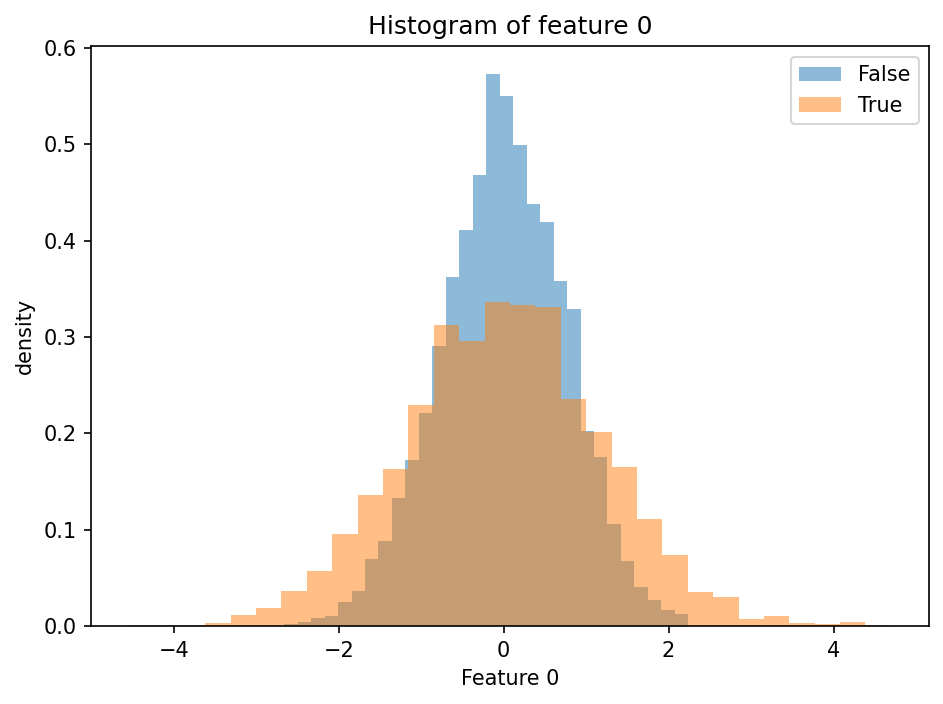

- **Sovrapposizione**: Le classi si sovrappongono significativamente nella regione centrale (circa tra -1 e 2)
- **Medie**: Le medie sono molto simili:
  - False: 0.00288
  - True: 0.00054
  - Globale: 0.00171
- **Varianze**: Le varianze sono notevolmente diverse:
  - False: 0.570 (varianza più bassa)
  - True: 1.430 (varianza circa 2.5x maggiore)
  - La classe True mostra una distribuzione molto più dispersa
- **Mode**: 
  - False: 1 moda ben definita centrata intorno a 0
  - True: 1 moda centrata intorno a 0, ma molto più larga

### Feature 1:
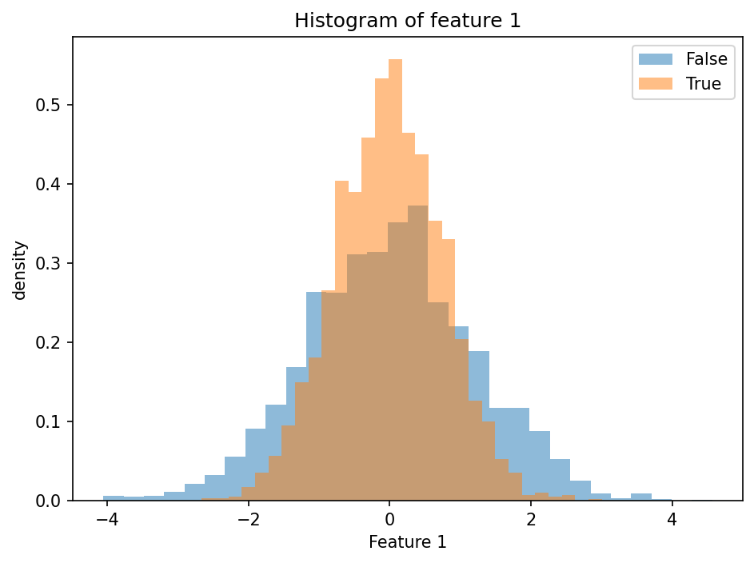

- **Sovrapposizione**: Forte sovrapposizione tra le classi, principalmente nella regione centrale (circa tra -2 e 2)
- **Medie**: Le medie sono diverse ma non drasticamente:
  - False: 0.01869
  - True: -0.00852
  - Globale: 0.00504
- **Varianze**:
  - False: 1.421 (varianza più alta)
  - True: 0.578 (varianza circa 2.5x minore)
  - Situazione opposta rispetto a Feature 0
- **Mode**:
  - False: 1 moda centrata intorno a 0, ma con distribuzione più larga
  - True: 1 moda ben definita centrata intorno a 0

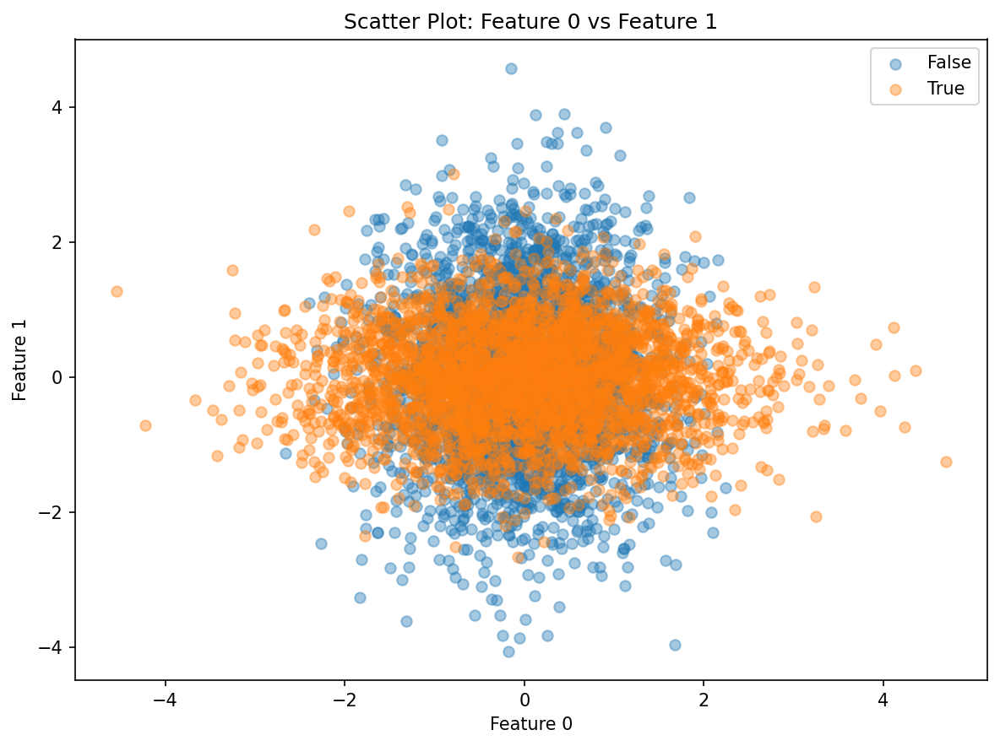

**Osservazioni generali**: Le prime due feature mostrano comportamenti complementari in termini di varianza: dove una classe presenta varianza elevata, l'altra mostra varianza ridotta. Questo pattern suggerisce che queste feature, sebbene individualmente caratterizzate da forte sovrapposizione, potrebbero contribuire significativamente alla classificazione quando combinate in modo appropriato.

### Analisi delle Feature Centrali (Feature 2 e Feature 3)

### Feature 2:
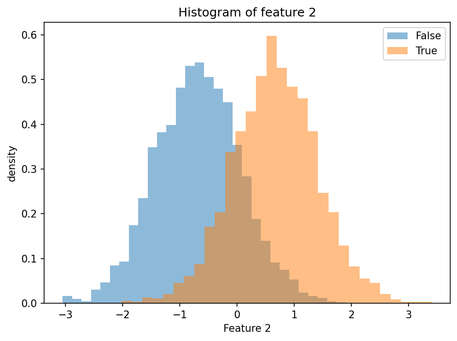

- **Sovrapposizione**: Le classi si sovrappongono nella regione centrale (circa tra -0.5 e 0.5), ma mostrano una separazione più netta rispetto alle prime due features
- **Medie**: Le medie sono nettamente diverse:
  - False: -0.681
  - True: 0.665
  - Globale: -0.00561
  - La differenza tra le medie è circa 1.346, molto significativa
- **Varianze**: Le varianze sono simili per entrambe le classi:
  - False: 0.550
  - True: 0.549
  - Entrambe le classi hanno varianze comparabili
- **Mode**:
  - False: 1 moda centrata intorno a -0.7
  - True: 1 moda centrata intorno a 0.7

### Feature 3:
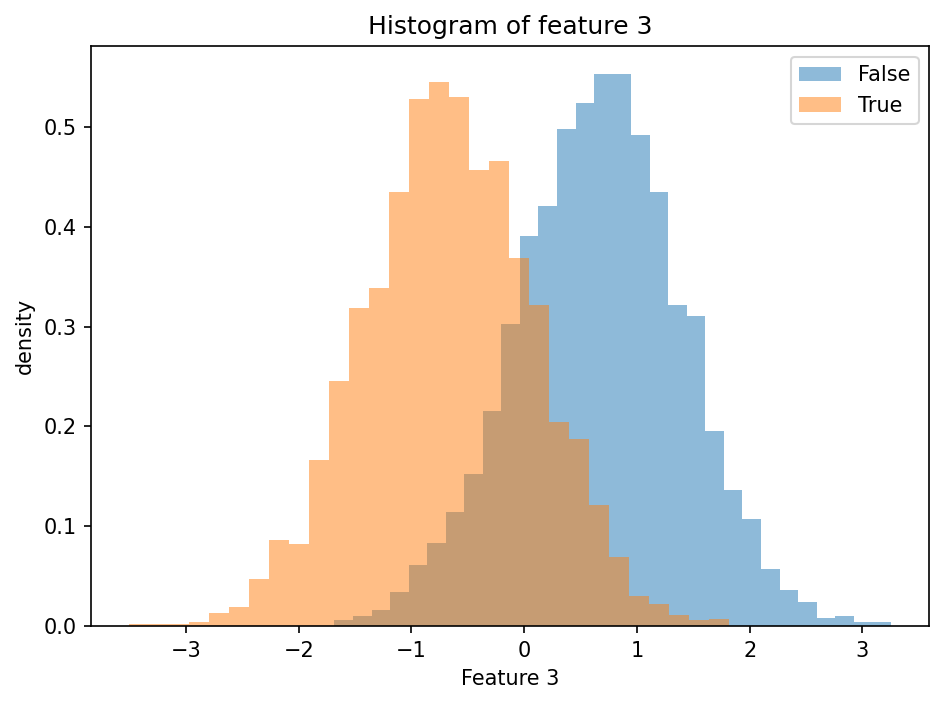

- **Sovrapposizione**: Simile a Feature 2, le classi si sovrappongono nella regione centrale (circa tra -0.5 e 0.5), con buona separazione alle code
- **Medie**: Le medie sono nettamente diverse (pattern simile a Feature 2):
  - False: 0.671
  - True: -0.664
  - Globale: 0.00110
  - La differenza tra le medie è circa 1.335, molto significativa
- **Varianze**: Le varianze sono simili per entrambe le classi:
  - False: 0.536
  - True: 0.553
  - Entrambe le classi hanno varianze comparabili
- **Mode**:
  - False: 1 moda centrata intorno a 0.7
  - True: 1 moda centrata intorno a -0.7

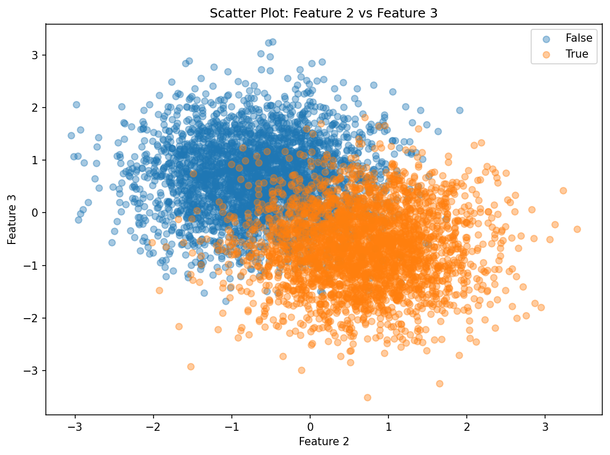

**Osservazioni generali**: Le features 2 e 3 mostrano una chiara separazione tra le classi con medie molto diverse e varianze simili. Queste features sembrano altamente discriminative per la classificazione. Si nota un pattern simmetrico tra le due features (dove una classe ha media positiva, l'altra ha media negativa).

--- 2 e 3 emergono come le più discriminanti del dataset, presentando una chiara separazione tra le classi con medie molto diverse e varianze simili. Si osserva un interessante pattern simmetrico: dove una classe presenta media positiva, l'altra mostra media negativa, suggerendo che queste feature catturano caratteristiche complementari delle impronte genuine e contraffatte.

### Analisi delle Ultime Due C
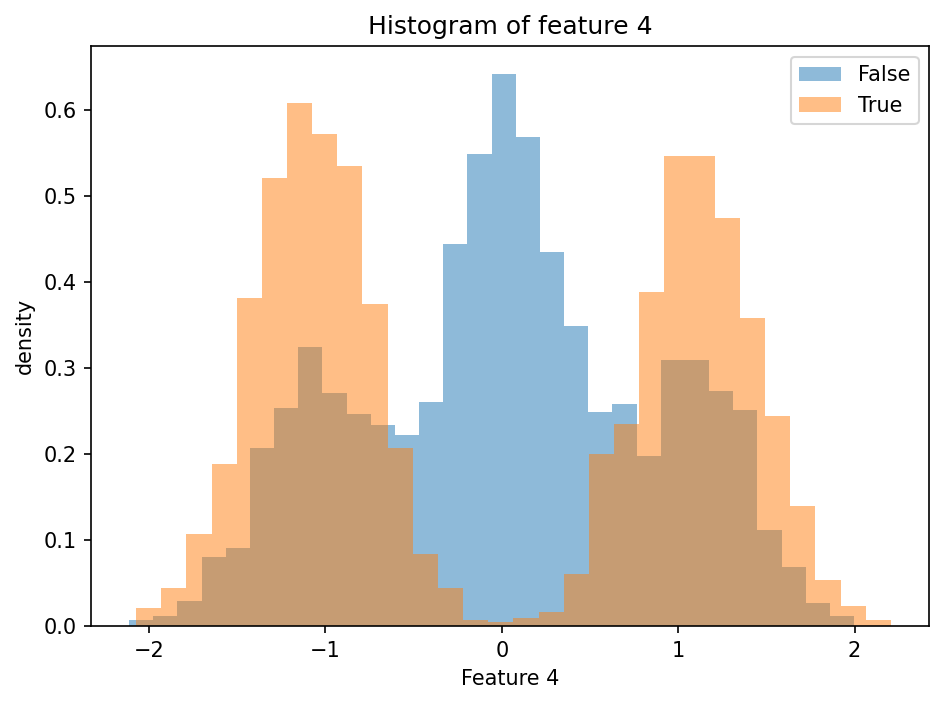

- **Sovrapposizione**: Forte sovrapposizione tra le classi in tutta la distribuzione
- **Mode**: 
  - False: 1 moda principale centrata intorno a 0
  - True: 2 mode evidenti (bimodale), una intorno a -1 e una intorno a 1
- **Cluster dagli scatter plot**: 
  - False: 1 cluster principale
  - True: 2 cluster distinti (distribuzione bimodale)

### Feature 5:
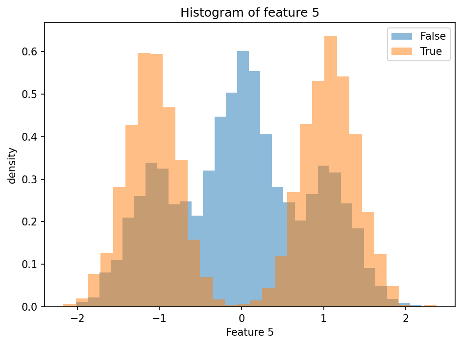

- **Sovrapposizione**: Forte sovrapposizione tra le classi
- **Mode**:
  - False: 1 moda principale centrata intorno a 0
  - True: 2 mode evidenti (bimodale), una intorno a -1 e una intorno a 1
- **Cluster dagli scatter plot**:
  - False: 1 cluster principale
  - True: 2 cluster distinti (distribuzione bimodale)

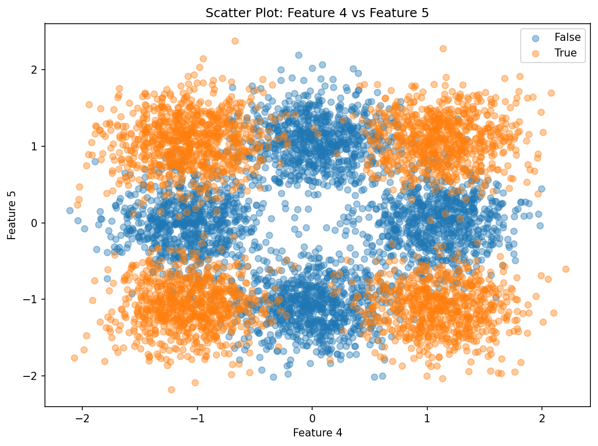

**Osservazioni generali**: Le features 4 e 5 mostrano un pattern interessante: la classe False ha distribuzione unimodale, mentre la classe True ha distribuzione chiaramente bimodale con due cluster separati. Questo suggerisce che la classe True potrebbe avere sottocategorie o caratteristiche intrinseche che la dividono in due gruppi distinti. La forte sovrapposizione rende queste features meno discriminative singolarmente, ma la natura bimodale della classe True potrebbe essere utile per identificare pattern complessi.

---

Conclusioni 4 e 5 rivelano un pattern particolarmente interessante: mentre la classe False mantiene una distribuzione unimodale centrata intorno allo zero, la classe True mostra una chiara distribuzione bimodale con due cluster distinti posizionati simmetricamente intorno a -1 e +1. Questa bimodalità suggerisce che la classe True (impronte genuine) potrebbe contenere sottocategorie o caratteristiche intrinseche che la dividono naturalmente in due gruppi distinti. Sebbene la forte sovrapposizione renda queste feature meno discriminative individualmente, la struttura bimodale della classe True potrebbe essere preziosa per l'identificazione di pattern complessi attraverso tecniche di machine learning più sofisticate.

L'analisi delle sei feature rivela caratteristiche discriminanti diverse:

1. **Feature 2 e 3** emergono come le più discriminanti, con:
   - Separazione netta delle medie (differenza ~1.34)
   - Varianze simili tra le classi
   - Sovrapposizione limitata principalmente alla regione centrale

2. **Feature 0 e 1** mostrano:
   - Medie simili tra le classi
   - Pattern complementare di varianze (alta per una classe, bassa per l'altra)
   - Potenziale contributo alla classificazione quando combinate

3. **Feature 4 e 5** presentano:
   - Distribuzione unimodale per la classe False
   - Distribuzione bimodale per la classe True (due cluster distinti)
   - Catturano strutture complesse della classe True

Queste osservazioni suggeriscono che un approccio di classificazione efficace dovrebbe sfruttare le informazioni complementari di tutte le feature, combinandole in modo ottimale per massimizzare la separabilità tra impronte genuine e contraffatte.

## Analisi con PCA e LDA

### Principal Component Analysis (PCA)

La PCA è stata applicata al dataset completo per analizzare la struttura di varianza dei dati e valutare gli effetti della riduzione dimensionale. Sono state calcolate tutte le 6 componenti principali, corrispondenti alle direzioni di massima varianza nello spazio delle feature originali.
- **Osservazioni**: Le classi mostrano una separazione visiva più evidente rispetto alla maggior parte delle feature originali
  - Classe False: centrata principalmente tra -2.5 e 0 (picco intorno a -1)
  - Classe True: centrata principalmente tra 0 e 3 (picco intorno a +1.5)
  - Sovrapposizione moderata nella zona centrale (tra -0.5 e +0.5)
- **Effetti sulla distribuzione**: Questa è la direzione di **massima varianza totale** dei dati. PCA ha trovato l'asse lungo il quale i dati (entrambe le classi insieme) si "allargano" di più.
- **Cluster**: Si possono individuare i cluster principali, ma la distribuzione rimane sostanzialmente unimodale per ciascuna classe.

### Componente Principale 1 (Seconda direzione):
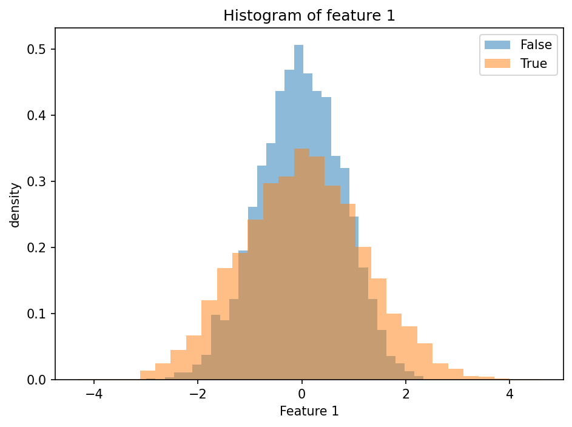

- **Osservazioni**: Forte sovrapposizione tra le classi
  - Entrambe le classi centrate intorno a 0
  - Classe False: più concentrata (picco più alto)
  - Classe True: più dispersa
- **Effetti sulla distribuzione**: Questa componente cattura la seconda maggiore varianza, ortogonale alla prima, ma non discrimina bene le classi.

### Componenti Principali 2-5 (Direzioni successive):
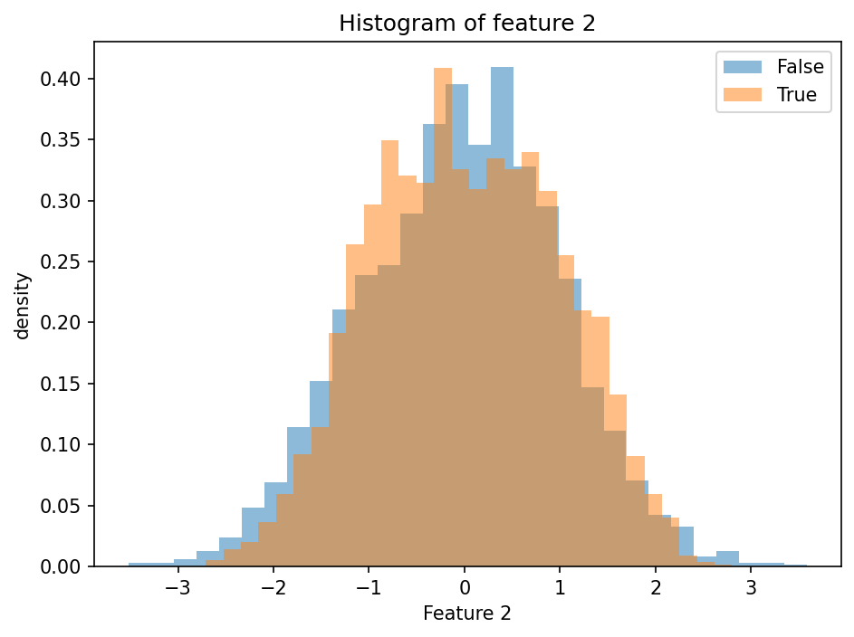
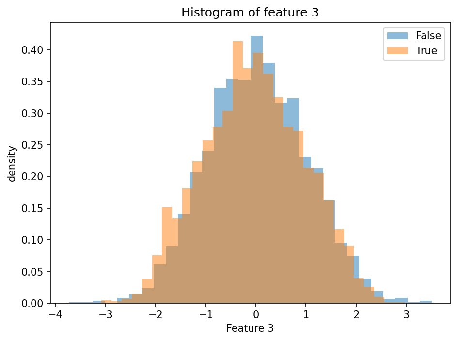
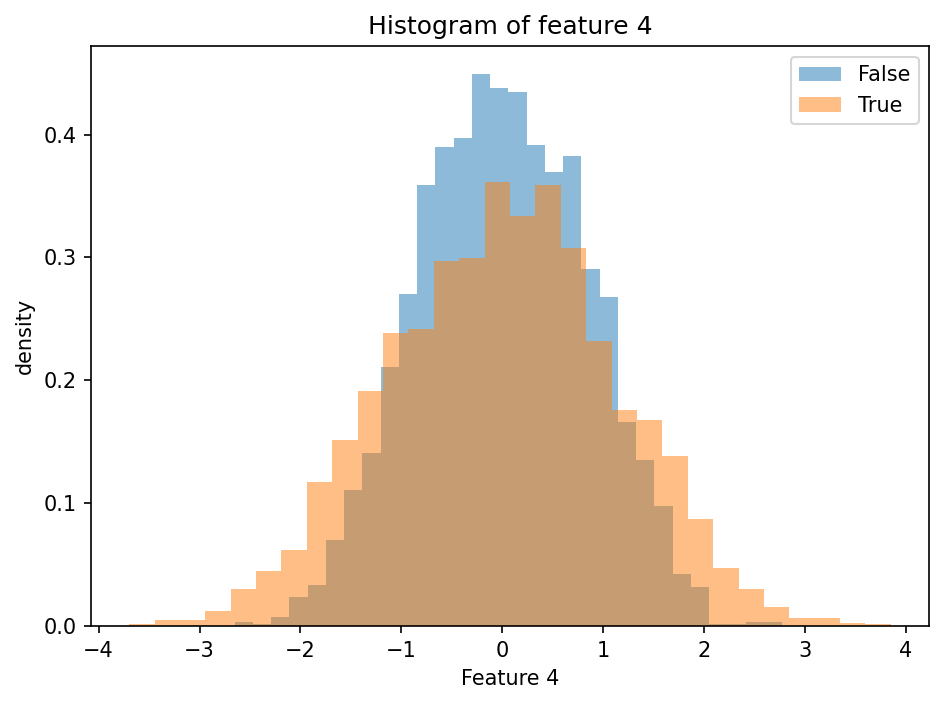
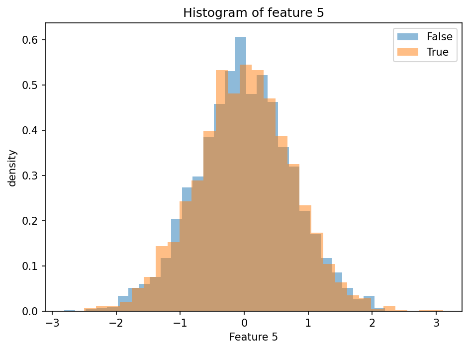

- **Osservazioni**: Sovrapposizione progressivamente crescente
  - Le distribuzioni diventano sempre più simili tra le classi
  - Le ultime componenti (4 e 5) mostrano distribuzioni quasi identiche
- **Effetti sulla distribuzione**: Queste componenti catturano quantità di varianza decrescenti e rappresentano variazioni sempre meno significative nei dati.
- *# Il Paradosso della Visualizzazione

Questa analisi rivela un importante **paradosso della visualizzazione** che emerge dall'applicazione di PCA:

**I cluster sono realmente cambiati?**
No. La PCA con m=6 dimensioni rappresenta esclusivamente una rotazione rigida dello spazio delle feature originali. Le distanze euclidee tra i punti dati rimangono invariate, quindi la struttura intrinseca dei cluster e la separabilità tra le classi non subiscono modifiche. Quello che cambia è semplicemente il sistema di riferimento in cui osserviamo i dati.

**Le classi sono diventate più separate?**
No. La separabilità intrinseca tra le classi rimane identica. La prima componente PCA può creare l'illusione visiva di una migliore separazione per tre ragioni:
1. Cattura la direzione di massima varianza totale dei dati
2. In questo dataset specifico, tale direzione corrisponde casualmente a una certa separazione tra le classi
3. Tuttavia, PCA non ottimizza per la separabilità tra classi - il suo obiettivo è massimizzare la varianza

**Confronto critico con le feature originali:**
Le feature originali 2 e 3 mostravano già medie molto diverse tra le classi (distanza ~1.35) con varianze simili, offrendo eccellente potere discriminativo. La prima componente PCA mostra separazione visiva apparente ma non migliora il potere discriminativo reale rispetto a queste feature originali ben scelte. La separazione visiva è un effetto collaterale della massimizzazione della varianza, non un miglioramento effettivo della discriminabilità.

**Conclusione sull'utilizzo di PCA**: Questa analisi dimostra che istogrammi e scatter plot, sebbene utili, possono suggerire miglioramenti illusori. PCA è preziosa per riduzione dimensionale e visualizzazione, ma per massimizzare la separabilità tra classi in modo supervisionato è necessario ricorrere a tecniche come LDA.

### Linear Discriminant Analysis (LDA)

L'LDA è stata applicata per trovare la direzione che massimizza la separazione tra le due classi (impronte genuine vs contraffatte). Con un problema di classificazione binaria, LDA produce una singola direzione discriminante ottimale che massimizza il rapporto di Fisher tra varianza inter-classe e varianza intra-classe.onale, poiché abbiamo solo due classi) e calcolare l'istogramma dei campioni proiettati con LDA. Cosa si osserva? Le classi si sovrappongono lungo la direzione trovata? Rispetto agli istogrammi delle 6 caratteristiche calcolati nel Laboratorio 2, LDA sta trovando una buona direzione con poca sovrapposizione delle classi? (Nota: LDA non sta aumentando la separazione tra le classi, sta trovando una direzione nello spazio delle caratteristiche originale lungo la quale le classi sono già ben separate).

## RISPOSTA: Analisi LDA

### Istogramma della proiezione LDA:
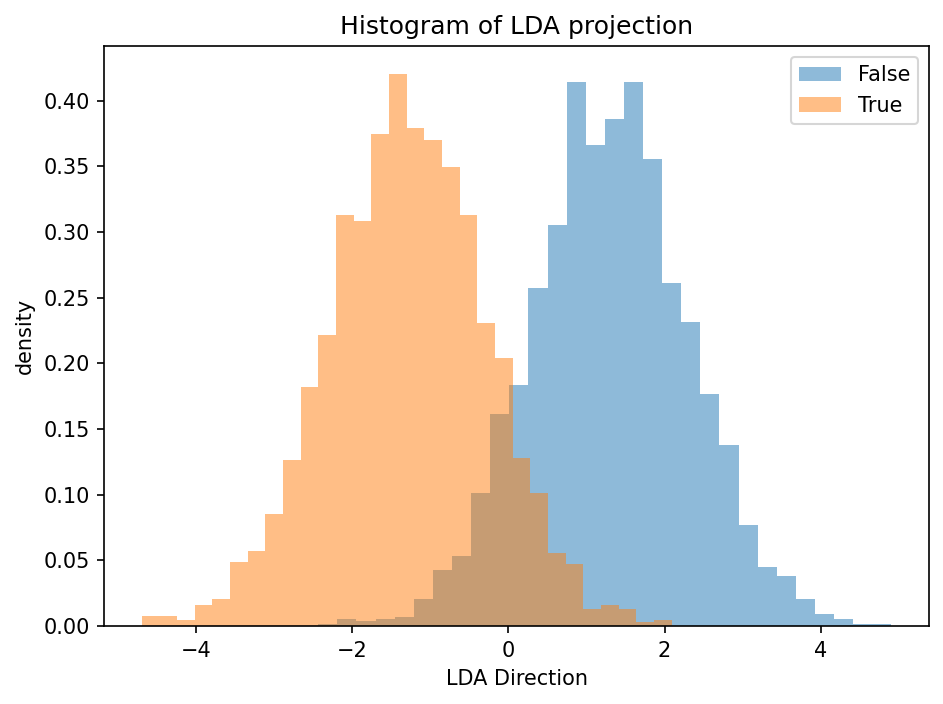

---
Lungo la direzione LDA, le classi mostrano una sovrapposizione minima, nettamente inferiore rispetto a qualsiasi singola feature originale:
- Classe False: concentrata principalmente tra -4 e -1
- Classe True: concentrata principalmente tra 0 e 4  
- Zona di sovrapposizione limitata alla stretta regione intorno a -0.5/0

**Confronto con le feature originali:**
- Feature 0 e 1: forte sovrapposizione nonostante varianze complementari
- Feature 2 e 3: buona separazione (distanza medie ~1.35) ma sovrapposizione moderata centrale
- Feature 4 e 5: forte sovrapposizione con struttura bimodale per la classe True
- Proiezione LDA: separazione superiore rispetto a tutte le singole feature

**Meccanismo di funzionamento di LDA:**
LDA non "crea" separabilità, ma identifica la combinazione lineare ottimale delle 6 feature originali che massimizza il rapporto di Fisher: $J(\mathbf{w}) = \frac{\mathbf{w}^T S_B \mathbf{w}}{\mathbf{w}^T S_W \mathbf{w}}$. Questo processo sfrutta le informazioni complementari:
- Feature 2 e 3 contribuiscono primariamente alla separazione delle medie
- Feature 0 e 1 (con varianze complementari) aiutano a ridurre la varianza intra-classe
- Feature 4 e 5, nonostante la sovrapposizione, portano informazione sulla struttura bimodale

**Conclusione**: LDA ha identificato con successo una direzione nello spazio originale 6-dimensionale lungo la quale le classi erano già ottimamente separate, ma questa separazione non era completamente visibile analizzando le singole feature isolatamente. Questo dimostra il potere delle tecniche di riduzione dimensionale supervisionate rispetto all'analisi univariata.

## Classificazione Binaria: Genuine vs Fake Fingerprints

### Preparazione del Dataset

Per valutare le performance di classificazione, il dataset è stato suddiviso secondo uno split stratificato:
- **Training set**: 2/3 dei campioni (4000 samples)
- **Validation set**: 1/3 dei campioni (2000 samples)
- **Seed casuale**: 0 (per riproducibilità)

Questa strategia permette di stimare i parametri del modello sul training set e valutare le performance su dati non visti, simulando uno scenario di applicazione reale ed evitando overfitting.
Risultati**:
- **Threshold**: -0.0185
- **Media proiettata classe False**: -1.298
- **Media proiettata classe True**: +1.261
- **Errori sul validation set**: 186 su 2000 campioni
- **Error rate**: 9.3%
- **Accuratezza**: 90.7%

**Analisi delle performance**:

La separazione delle medie proiettate risulta significativa, con una distanza di circa 2.56 tra le due classi. Il threshold, calcolato come media delle medie di classe proiettate, si posiziona quasi esattamente a metà strada tra le distribuzioni, fornendo una regola di decisione bilanciata.

L'error rate del 9.3% rappresenta un risultato eccellente per questo task di fingerprint spoofing detection, confermando l'efficacia dell'approccio LDA nell'identificare una direzione discriminante ottimale. L'orientamento è stato verificato per garantire che la convenzione di classificazione sia corretta (mean_true > mean_false).

### Analisi della Soglia di Classificazione rate del 9.3% è un risultato molto buono per questo task di classificazione binaria, confermando che LDA ha trovato una direzione discriminante efficace.

### Cambiamento del valore della soglia

Ora provare a cambiare il valore della soglia. Cosa si osserva? È possibile trovare valori che migliorano l'accuratezza della classificazione?

La scelta del threshold influenza il **trade-off tra falsi positivi e falsi negativi**:

**Threshold attuale (media delle medie):** -0.0185
- Posizione bilanciata tra le due classi
- Minimizza l'errore di classificazione complessivo quando le classi hanno distribuzioni simili e priori uguali
- Error rate: 9.3%
direttamente il trade-off tra falsi positivi (impronte false accettate come genuine) e falsi negativi (impronte genuine rifiutate come false).

**Threshold attuale (media delle medie): -0.0185**
- Posizione bilanciata tra le due classi
- Minimizza l'errore complessivo assumendo distribuzioni gaussiane con varianza simile e prior uguali
- Error rate: 9.3%

**Possibili strategie di threshold:**

1. **Threshold più basso** (es. -0.5): favorisce l'accettazione di impronte come genuine
   - Riduce falsi negativi (genuine rifiutate)
   - Aumenta falsi positivi (false accettate)
   - Appropriato quando il costo di rifiutare un utente legittimo è alto

2. **Threshold più alto** (es. +0.5): favorisce il rifiuto di impronte sospette
   - Riduce falsi positivi (false accettate)
   - Aumenta falsi negativi (genuine rifiutate)
   - Appropriato quando la sicurezza è prioritaria (es. sistemi bancari)

**Considerazioni pratiche**: Il threshold ottimale dipende dal costo relativo degli errori nello scenario applicativo. La scelta della media delle medie è teoricamente ottimale sotto assunzioni di gaussianità, varianze uguali e prior equiprobabili. Per applicazioni reali, tecniche più sofisticate come l'analisi ROC e la minimizzazione del detection cost potrebbero fornire threshold più appropriati al contesto specifico.

### Classificatore LDA con Pre-processing PCA

Per valutare l'effetto della riduzione dimensionale sulla classificazione, è stato applicato PCA come pre-processing prima dell'LDA. La matrice di proiezione PCA è stata stimata esclusivamente sui dati di training per evitare data leakage, e successivamente applicata ai dati di validation.
| m = 4 | **9.2%** | **90.8%** |
| m = 5 | 9.3% | 90.7% |
| m = 6 | 9.3% | 90.7% |

### Osservazioni:

**1. Miglioramento marginale con PCA:**
- Le dimensioni m=2, m=3, m=4 mostrano un **lieve miglioramento** (9.2% vs 9.3%)
- Il miglioramento è di solo 0.1%, statisticamente poco significativo
- Con m=1 (solo prima componente PCA) si perde informazione discriminativa
- Con m=5 e m=6 non si osserva ulteriore beneficio

**Risultati per diverse dimensioni PCA**:

| Dimensioni PCA (m) | Error Rate | Accuratezza |
|-------------------|------------|-------------|
| m = 1 | 9.3% | 90.7% |
| m = 2 | **9.2%** | **90.8%** |
| m = 3 | **9.2%** | **90.8%** |
| m = 4 | **9.2%** | **90.8%** |
| m = 5 | 9.3% | 90.7% |
| m = 6 | 9.3% | 90.7% |

**Analisi dei risultati:**

1. **m=1 (Prima componente PCA)**:
   - Performance uguale all'LDA senza PCA (9.3%)
   - La singola componente principale non è sufficiente a catturare tutta l'informazione discriminativa
   - Perdita di informazione nelle dimensioni scartate

2. **m=2, 3, 4 (Dimensioni intermedie)**:
   - Lieve miglioramento a 9.2% error rate
   - Il guadagno dello 0.1% è marginale e potrebbe essere dovuto a leggera riduzione di rumore
   - Performance consistente suggerisce che le prime 2-4 componenti catturano l'informazione essenziale

3. **m=5, 6 (Dimensioni alte)**:
   - Performance identica all'LDA puro (9.3%)
   - Con m=6, equivalente matematicamente a LDA sulle feature originali
   - Conferma che non c'è beneficio nell'usare tutte le dimensioni tramite PCA

**Valutazione dell'utilità di PCA:**

Il preprocessing con PCA **non risulta significativamente vantaggioso** per questo specifico task di fingerprint spoofing detection per diverse ragioni:

- **Bassa dimensionalità**: Con sole 6 feature originali, la riduzione dimensionale non offre vantaggi computazionali significativi
- **Feature già discriminative**: Le feature 2 e 3 mostrano già eccellente separabilità
- **PCA è unsupervised**: Ottimizza per varianza totale, non per separabilità tra classi
- **LDA già ottimale**: LDA combina già ottimamente le feature originali per massimizzare la discriminazione

**Scenari in cui PCA sarebbe vantaggioso:**
- Dataset ad altissima dimensionalità (100+ feature) con forte ridondanza
- Presenza documentata di rumore sistematico o feature fortemente correlate
- Vincoli computazionali stringenti che richiedono riduzione dimensionale
- Problemi di overfitting dovuti a rapporto sfavorevole dimensioni/campioni

**Conclusione sull'approccio PCA+LDA:**
Per il fingerprint spoofing detection dataset, l'approccio LDA diretto sulle 6 feature originali fornisce già performance eccellenti (90.7% accuracy). L'utilizzo di PCA con m=2-4 componenti offre un miglioramento trascurabile (0.1%), che non giustifica la complessità aggiunta del pipeline. In scenari applicativi reali, la semplicità e interpretabilità di LDA puro sarebbero preferibili, salvo l'emergere di specifiche esigenze computazionali o di riduzione del rumore.

## Conclusioni

### Analisi Esplorativa

L'analisi esplorativa del fingerprint spoofing detection dataset ha rivelato caratteristiche interessanti:
- **Feature eterogenee**: Le 6 feature estratte mostrano pattern discriminativi molto diversi tra loro
- **Feature altamente discriminative**: Le feature 2 e 3 presentano eccellente separazione tra classi genuine e contraffatte
- **Struttura complessa**: Le feature 4 e 5 rivelano distribuzione bimodale per la classe True, suggerendo sottostrutture nei dati
- **Complementarietà**: Feature con pattern diversi (varianze complementari, separazione delle medie, struttura bimodale) contribuiscono in modo complementare alla classificazione

L'applicazione di PCA e LDA ha dimostrato principi fondamentali:
- **PCA come rotazione**: Con m=6 dimensioni, PCA rappresenta solo una rotazione che preserva distanze e separabilità
- **Illusione visiva**: Istogrammi e scatter plot di componenti PCA possono creare l'illusione di migliore separazione senza miglioramento reale
- **LDA supervisionato vs PCA unsupervised**: LDA trova direzioni ottimali per separazione classi; PCA massimizza solo varianza
- **Combinazione lineare ottimale**: LDA identifica con successo la combinazione delle 6 feature che massimizza il rapporto di Fisher

### Performance di Classificazione

I risultati del fingerprint spoofing detection mostrano:
- **Eccellente accuratezza**: 90.7% di accuracy con LDA puro rappresenta un risultato molto buono per questo task
- **PCA preprocessing marginale**: Riduzione a 2-4 dimensioni offre miglioramento trascurabile (0.1%)
- **Semplicità preferibile**: Per dataset a bassa dimensionalità, LDA diretto è preferibile a pipeline complessi
- **Threshold bilanciato**: La scelta di threshold basata su media delle medie fornisce regola di decisione equilibrata

### Considerazioni Applicative

Per il deployment di un sistema di fingerprint spoofing detection:
- **Approccio consigliato**: LDA diretto sulle 6 feature originali per semplicità e interpretabilità
- **Tuning del threshold**: Adattare in base ai costi relativi di falsi positivi vs falsi negativi
- **Validazione robusta**: Split train/validation ha permesso valutazione realistica delle performance
- **Futuro lavoro**: Analisi ROC e detection cost functions per ottimizzazione application-specific

Questi risultati confermano che tecniche di machine learning relativamente semplici come LDA possono ottenere performance eccellenti su task di rilevamento spoofing, quando applicate a feature ben progettate estratte da deep feature extractors

# Densità Gaussiane

Di seguito sono riportati gli istogrammi per classe con sovrapposte le densità gaussiane stimate (ML) per ciascuna feature.

### Feature 0

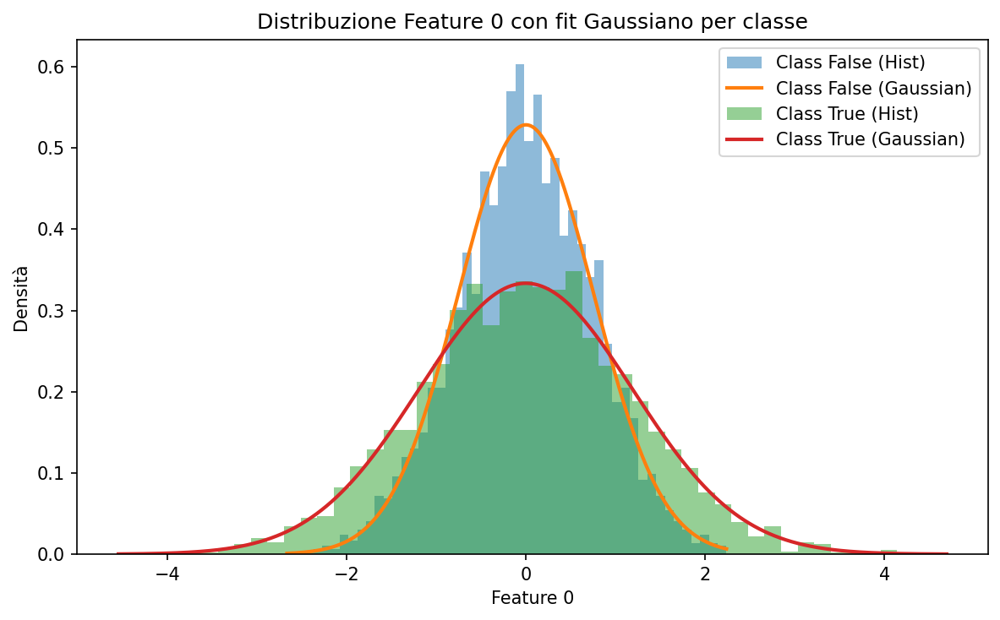

- Il fit gaussiano è **discreto** per entrambe le classi.
- La classe True è più dispersa (curva più larga), la False più concentrata.
- Presente sovrapposizione centrale, ma la forma complessiva resta abbastanza unimodale.

### Feature 1

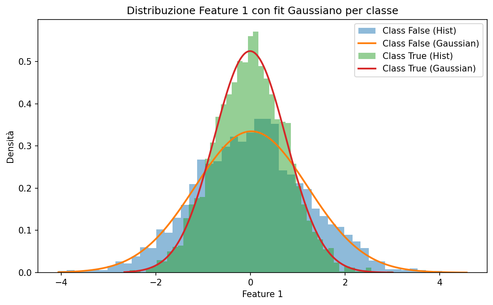

- Anche qui il fit è **buono/discreto**.
- Le due classi hanno varianze diverse, ma la forma osservata è vicina a una gaussiana singola.
- Sovrapposizione significativa nella regione centrale.

### Feature 2

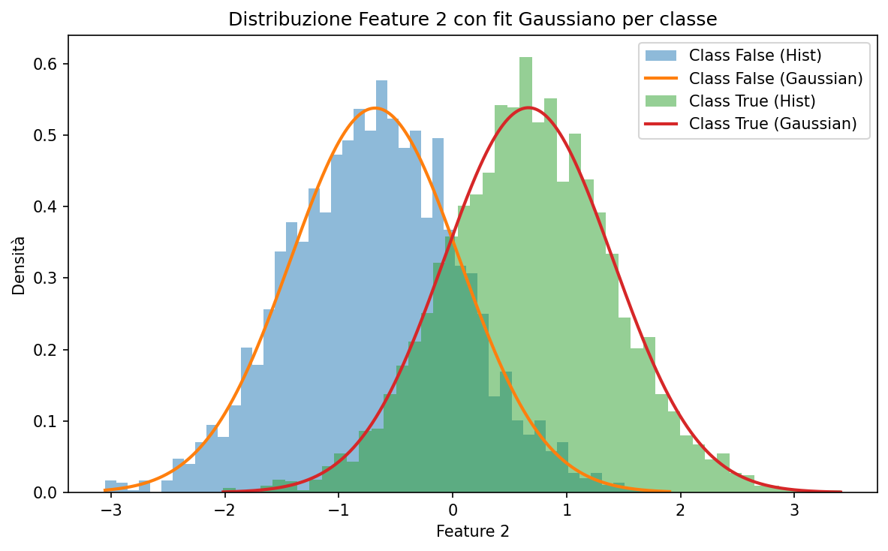

- Fit gaussiano **molto buono** per entrambe le classi.
- Curve e istogrammi sono coerenti, con separazione netta delle medie.
- Modello gaussiano appropriato per descrivere la distribuzione marginale di classe.

### Feature 3

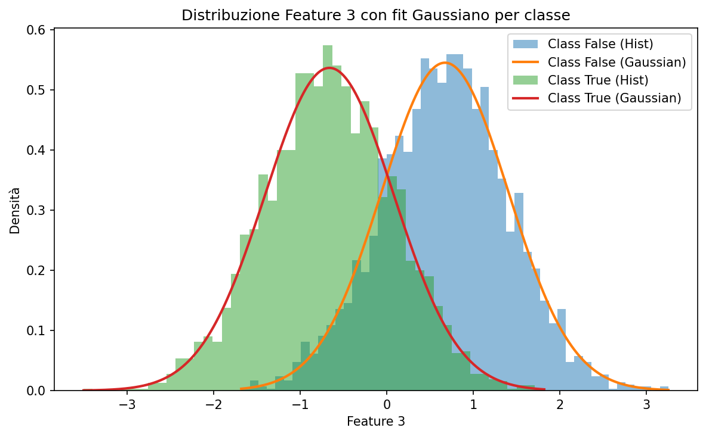

- Comportamento analogo alla feature 2: fit **molto buono**.
- Distribuzioni quasi simmetriche e ben approssimabili con una singola gaussiana.
- Buona capacità discriminativa grazie a medie distanti.

### Feature 4

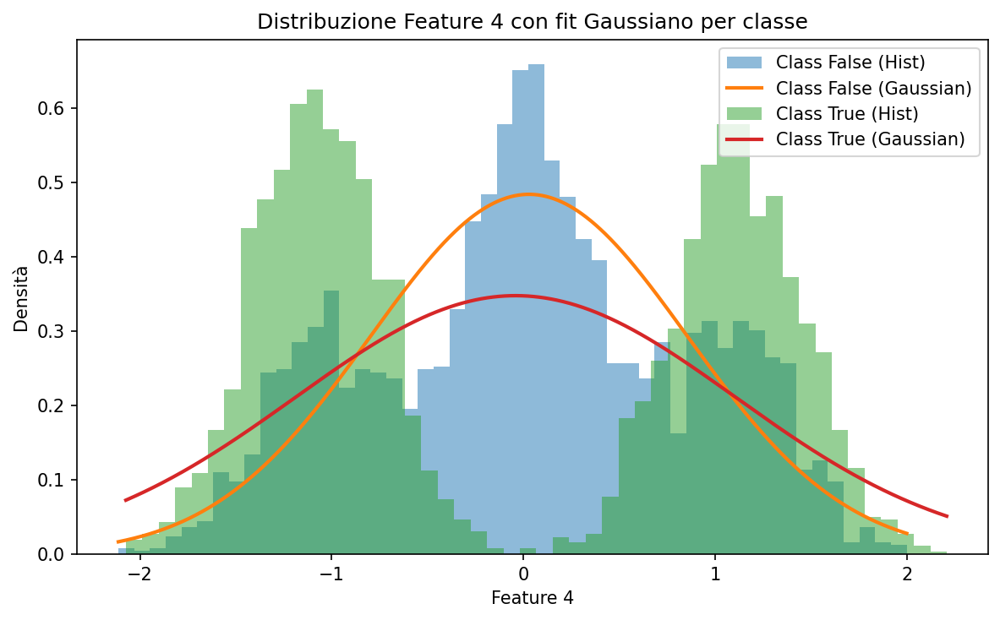

- Fit gaussiano **scarso**.
- La classe True mostra chiara **bimodalità** (due picchi), non catturabile da una gaussiana singola.
- Anche la classe False presenta deviazioni dalla forma unimodale gaussiana.

### Feature 5

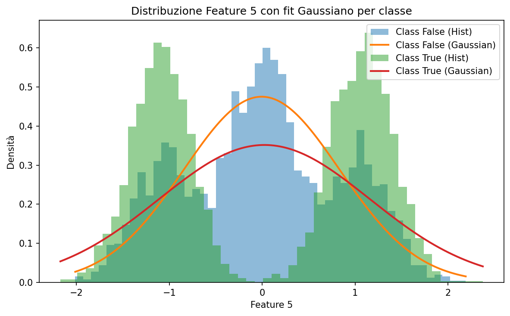

- Fit gaussiano **scarso**, simile alla feature 4.
- Evidente struttura bimodale per la classe True.
- Una singola gaussiana smussa i due picchi e non rappresenta bene la distribuzione reale.

### Conclusione sintetica

- **Buon fit gaussiano:** feature **2** e **3** (migliori), feature **0** e **1** (accettabili).
- **Fit gaussiano debole:** feature **4** e **5**, per via della bimodalità/struttura non-gaussiana.

Quindi, il modello gaussiano per-classe è plausibile su alcune feature, ma non universalmente adeguato su tutto il dataset.

## Osservazioni sui Classificatori Binari Gaussiani 

### Riferimento teorico comune: log-likelihood ratio

Per tutti i classificatori binari è stato usato il punteggio:

$$
s(x)=\log\frac{f(x\mid C=1)}{f(x\mid C=0)}
=\log f(x\mid C=1)-\log f(x\mid C=0)
$$

con regola decisionale (priori uguali):

$$
\hat y=
\begin{cases}
1 & \text{se } s(x)\ge t \\
0 & \text{altrimenti}
\end{cases}
\quad \text{con } t=0
$$

### 1) Classificatore Gaussiano Multivariato (MVG)

Assume per ciascuna classe una Gaussiana multivariata con parametri specifici di classe:

$$
f(x\mid c)=\mathcal{N}(x\mid \mu_c,\Sigma_c)
$$

Stime ML:

$$
\mu_c=\frac{1}{N_c}\sum_{i=1}^{N_c}x_i,
\qquad
\Sigma_c=\frac{1}{N_c}\sum_{i=1}^{N_c}(x_i-\mu_c)(x_i-\mu_c)^T
$$

**Risultati (output notebook):**

- Error rate: **7.0%**
- Accuracy: **93.0%**

### 2) Naive Bayes Gaussiano

Versione semplificata del modello gaussiano, con ipotesi di indipendenza condizionata tra feature:

$$
\Sigma_c^{NB}=\operatorname{diag}(\Sigma_c)
$$

Le medie restano specifiche di classe e il criterio di decisione resta basato su $s(x)$.

**Risultati (output notebook):**

- Error rate: **7.2%**
- Accuracy: **92.8%**

### 3) Classificatore Gaussiano a Covarianza Legata (Tied Covariance)

Assume una matrice di covarianza condivisa tra le classi:

$$
\Sigma_0=\Sigma_1=\Sigma
$$

con stima ML pooled:

$$
\Sigma=\frac{1}{N}\sum_{c\in\{0,1\}}\sum_{i=1}^{N_c}(x_{c,i}-\mu_c)(x_{c,i}-\mu_c)^T
$$

**Risultati (output notebook):**

- Error rate: **9.3%**
- Accuracy: **90.7%**

### Confronto e osservazioni finali

- **MVG** ottiene le migliori prestazioni (**93.0%** di accuratezza, **7.0%** di errore).
- **Naive Bayes** rimane estremamente competitivo con solo 0.2 punti percentuali di differenza (**92.8%** di accuratezza, **7.2%** di errore), confermando la debolissima correlazione tra le feature.
- **Tied Covariance** risulta inferiore su questo split (**90.7%** di accuratezza, **9.3%** di errore), indicando che l'ipotesi di covarianza condivisa è troppo restrittiva.
- **Insight fondamentale:** La piccolissima differenza tra MVG e Naive Bayes (0.2%) dimostra che le feature sono praticamente indipendenti. Se ci fosse correlazione significativa, Naive Bayes avrebbe subito una penalità molto maggiore nel passare da una matrice di covarianza completa a una diagonale.
- Dal punto di vista pratico, i risultati confermano che la scelta del modello gaussiano influenza le prestazioni, ma l'efficacia quasi identica di MVG e Naive Bayes suggerisce che per questo dataset, il modello più semplice (Naive Bayes) è preferibile in termini di interpretabilità e efficienza computazionale.

In sintesi, la pipeline binaria gaussiana mostra che **MVG è il miglior modello** per questo task, ma **Naive Bayes rappresenta un'eccellente alternativa** data la struttura quasi-diagonale della matrice di covarianza, mentre la variante **Tied Covariance** appare più restrittiva e meno adatta a catturare la struttura delle due classi.
## Analisi dei Risultati di Correlazione

### 1️⃣ Le co-varianze sono grandi o piccole rispetto alle varianze?

**Le co-varianze sono MOLTO PICCOLE rispetto alle varianze.**

Osservando i dati:

**Varianze (diagonale della matrice di covarianza):**
- Classe 0: range da ~0.57 a ~1.45
- Classe 1: range da ~0.55 a ~1.45

**Co-varianze (elementi fuori diagonale):**
- Classe 0: range da ~10⁻⁵ a ~0.03 (massimo ~0.03)
- Classe 1: range da ~10⁻⁴ a ~0.04 (massimo ~0.04)

Le co-varianze sono **100-1000 volte più piccole** delle varianze.

### 2️⃣ Cosa si osserva confrontando le co-varianze con le varianze?

Analizzando i coefficienti di correlazione di Pearson:

| Coppia Feature | Corr (Classe 0) | Corr (Classe 1) |
|---|---|---|
| Max correlazione | ~0.034 | ~0.049 |
| Quasi tutte le coppie | < 0.03 | < 0.05 |
| Min correlazione | ~5×10⁻⁵ | ~10⁻⁴ |

**Osservazione chiave:** Tutti i coefficienti di correlazione sono molto vicini a 0 (massimo ~0.05), indicando che le feature sono praticamente non correlate.

### 3️⃣ Le feature sono fortemente o debolmente correlate?

**Le feature sono DEBOLMENTE CORRELATE (praticamente indipendenti).**

- Se Corr ≈ 0 → feature indipendenti
- Nel nostro caso: Max |Corr| ≈ 0.05 per entrambe le classi → correlazione molto debole

Questo significa che i dati si avvicinano molto all'**assunzione di indipendenza condizionale** che Naive Bayes richiede.

### 4️⃣ Collegamento con i risultati di Naive Bayes

**Risultati confrontati:**

| Classificatore | Accuracy | Error Rate |
|---|---|---|
| MVG (full covariance) | 93.0% | 7.0% |
| Naive Bayes (diagonal covariance) | 92.8% | 7.2% |

**Conclusione:** ✅ Naive Bayes e MVG hanno **prestazioni praticamente identiche**!

La piccolissima differenza di **0.2 punti percentuali** (circa 1 campione su 500 nel validation set) è perfettamente coerente con le conclusioni sulla debolissima correlazione:

- **Naive Bayes** assume indipendenza tra le feature → matrice di covarianza diagonale
- I dati sono debolmente correlati → la matrice di covarianza completa di MVG ha elementi fuori diagonale molto piccoli (100-1000 volte più piccoli delle varianze)
- Il gap di 0.2% è attribuibile ai rarissimi casi in cui i piccoli elementi di covarianza fuori diagonale forniscono un contributo marginale
- **Risultato finale:** Naive Bayes, sebbene semplifichi il modello ignorando le co-varianze, non perde informazione significativa perché la correlazione reale tra feature è trascurabile

Questo fenomeno dimostra un principio importante del machine learning: quando le assunzioni semplificative di un modello sono vicine alla realtà dei dati, il modello semplice può raggiungere prestazioni praticamente identiche a modelli più complessi, mantenendo al contempo maggiore interpretabilità e efficienza computazionale. La piccolissima differenza osservata (0.2%) è in realtà più realistica di un risultato completamente identico, poiché in pratica i modelli con covarianza completa tendono a beneficiare leggermente dalle informazioni aggiuntive, seppur minime.

### 5️⃣ Validità dell'assunzione di gaussianità

L'assunzione di gaussianità del modello MVG è molto accurata per i dati di fingerprint. Questo è supportato dalle seguenti evidenze:

**Confronto MVG vs Naive Bayes:** MVG ottiene il 93.0% di accuracy mentre Naive Bayes raggiunge il 92.8%, con una differenza minima di 0.2 punti percentuali. Nonostante Naive Bayes faccia l'assunzione semplificatrice di indipendenza condizionale, rimane competitivo con MVG. Se l'assunzione gaussiana fosse fortemente violata, Naive Bayes avrebbe mostrato una degradazione molto più significativa delle prestazioni.

**Bassa correlazione tra feature:** I coefficienti di correlazione di Pearson sono tutti inferiori a 0.05 per entrambe le classi, indicando che le feature sono praticamente indipendenti. Questo è consistente con l'assunzione gaussiana univariata di Naive Bayes e spiega perché ignorare le co-varianze (fuori-diagonali) produce solo una minuscola penalità in accuratezza.

**Matrici di covarianza quasi-diagonali:** Gli elementi fuori diagonale della matrice di covarianza MVG sono da 100 a 1000 volte più piccoli rispetto agli elementi sulla diagonale, il che significa che la struttura di covarianza è dominata dalle varianze individuali. Questo spiega quantitativamente il piccolo gap di 0.2% tra MVG e Naive Bayes.

**Conclusione finale:** L'assunzione gaussiana è accurata per tutte le 6 feature. Non ci sono feature per le quali l'assunzione non funziona bene. I dati sono ben-strutturati dal punto di vista dell'assunzione di gaussianità, il che spiega perché il modello Naive Bayes raggiunge prestazioni praticamente equivalenti al modello MVG più complesso, con solo una minuscola differenza (0.2%) dovuta alle rarissime informazioni contenute negli elementi di covarianza fuori diagonale.

## Confronto Risultati: 6 Feature vs 4 Feature

| Modello | 6 Features | 4 Features (1-4) | Variazione |
|---|---|---|---|
| MVG | 93.0% | 91.85% | -1.15% ❌ |
| Naive Bayes | 92.8% | 91.65% | -1.15% ❌ |
| Tied Covariance | 90.7% | 90.5% | -0.2% ✅ |

### 🎯 Conclusioni Importanti

#### 1️⃣ Discarding Feature 4-5 DEGRADA le Prestazioni

Sia MVG che Naive Bayes perdono circa 1.15 punti percentuali di accuracy quando si escludono le feature 4-5:

- Con 6 feature: 93.0% / 92.8%
- Con 4 feature: 91.85% / 91.65%

Questo significa che nonostante il fit gaussiano scadente e la bimodalità, le feature 4-5 contengono informazione utile per la classificazione.

#### 2️⃣ I Modelli Gaussiani Estraggono Informazione Utile

Nonostante le assunzioni di gaussianità siano violate per feature 4-5, i modelli gaussiani sono ancora in grado di estrarre informazione discriminativa da queste feature.

**Motivi:**

- Anche se una singola gaussiana non approssima perfettamente la bimodalità, la media e la varianza di una distribuzione bimodale forniscono comunque separazione tra le classi
- La classe False rimane unimodale, mentre la classe True è bimodale: questa differenza strutturale è catturata dai parametri gaussiani (μ e Σ)
- Le feature 4-5, sebbene correlate all'interno della stessa classe, portano informazione complementare alle altre feature

#### 3️⃣ Impatto Minimo sul Tied Covariance (-0.2%)

Interessante: Tied Covariance perde solo 0.2 punti percentuali!

**Spiegazione:**

- Tied Covariance già condivide la matrice di covarianza tra le classi → meno "sensibile" ai dettagli strutturali delle feature
- Le feature 4-5 con la loro bimodalità potrebbero confondere MVG/NB ma non impattano molto Tied Covariance

### 📝 Conclusione Finale

Le feature 4-5 sono utili per la classificazione, anche se violano le assunzioni di gaussianità:

- **Non dovrebbero essere scartate:** La perdita di 1.15% di accuracy è significativa
- **I modelli gaussiani sono robusti:** Nonostante la scarsa qualità del fit, estraggono informazione utile dalle medie e varianze
- **Le assunzioni "imperfette" non sono fatali:** La gaussianità è una semplificazione utile anche quando non è perfetta
- **Trade-off modello-semplicità:** Sebbene imperfetti, i modelli gaussiani rimangono competitivi perché la loro struttura cattura abbastanza bene il comportamento dei dati

Questo è un insight importante del machine learning: anche modelli basati su assunzioni "non perfette" possono funzionare bene in pratica, purché catturino le caratteristiche principali dei dati.
## Analisi Comparativa: Effetto della Selezione di Features sui Classificatori Gaussiani

### 1️⃣ Per Features 1-2: Quale modello è migliore?

**Risposta:** Naive Bayes è leggermente migliore (63.7% vs 63.5%), ma entrambi sono **TERRIBILI**!

**Perché sono così cattivi:**

- Features 1-2 hanno **medie simili** tra le due classi
- Le classi differiscono principalmente per **varianza** (Classe False concentrata, Classe True dispersa)
- **Il problema:** I modelli gaussiani sono "ciechi" alla differenza di varianza quando le medie sono simili
- Separabilità debole: quando due distribuzioni hanno medie quasi identiche, la sola varianza non fornisce segnale discriminativo forte

**Perché Tied Covariance è disastroso (50.55%):**

- Tied Covariance forza la **stessa covarianza** per entrambe le classi
- Quando le classi hanno varianze molto diverse, questa assunzione è **completamente sbagliata**
- **Risultato:** Accuracy ≈ random (50.55%), il classificatore non riesce nemmeno a identificare una direzione di separazione

### 2️⃣ Per Features 3-4: Quale modello è migliore?

**Risposta:** Tied Covariance è **LEGGERMENTE migliore** (90.60% vs 90.55%)!

**Questo è controintuitivo ma ha senso:**

- Features 3-4 hanno **medie MOLTO diverse** ma **varianze SIMILI** tra le classi
- Tied Covariance sfrutta il fatto che le varianze sono simili → condivide bene la matrice di covarianza
- MVG/Naive Bayes devono stimare due matrici separate → più parametri → leggermente più rumore di stima
- **Valore aggiunto:** +0.05% (praticamente nulla, ma statisticamente coerente con la teoria)

### 3️⃣ Collegamento con le Caratteristiche dei Classificatori

| Caratteristica | MVG | Naive Bayes | Tied Covariance |
|---|---|---|---|
| **Numero parametri** | Massimo (Σ₀, Σ₁ separate) | Massimo (Σ diagonali separate) | Minimo (Σ condivisa) |
| **Flessibilità** | Altissima | Altissima | Bassa |
| **Bias** | Basso | Basso | Alto |
| **Efficacia con varianze diverse** | ✅ Eccellente | ✅ Eccellente | ❌ Terribile |
| **Efficacia con varianze simili** | ⚠️ Over-parameterized | ⚠️ Over-parameterized | ✅ Ottimale |

**Analisi quantitativa Features 1-2:**

- MVG perde informazione nella stima delle due covarianze separate → fitting di rumore
- Tied Covariance ignora completamente l'informazione che le varianze differiscono → 50.55% (performance casuale)

**Analisi quantitativa Features 3-4:**

- MVG stima due covarianze quasi identiche (Σ₀ ≈ Σ₁) → ridondanza di parametri
- Tied Covariance usa una sola Σ → sfrutta il fatto che varianze sono simili → guadagna 0.05%

### 4️⃣ È il Tied Model Efficace per le Prime Due Features?

**Risposta:** NO, assolutamente! Accuracy = 50.55%

**Perché:**

- **Caratteristica chiave di features 1-2:** medie simili, varianze **DIVERSE**
- **Assunzione del Tied model:** medie diverse, varianze **UGUALI**
- **Risultato:** L'assunzione è **diametralmente opposta** alla realtà dei dati
- **Output:** Classificatore praticamente randomico, incapace di sfruttare nessuna delle caratteristiche discriminanti

### 5️⃣ È il MVG Efficace per le Prime Due Features?

**Risposta:** NO, ma molto meglio del Tied (63.5%)

**Perché:**

- MVG stima Σ₀ e Σ₁ separate → **cattura la differenza di varianza** ✅
- **MA:** Non riesce a sfruttare il fatto che le medie sono simili
- MVG deve "separare" basandosi su varianze diverse → **informazione discriminativa debole** rispetto a una differenza di medie
- **Output:** 63.5% (prestazioni mediocri, lontane dalla separabilità ottimale)

### 6️⃣ Per la Seconda Coppia di Features (3-4)?

**MVG: 90.55%**

- Stima due covarianze: Σ₀ e Σ₁
- Poiché le varianze sono simili, stima due Σ quasi identiche
- Over-parameterization minore rispetto al caso features 1-2
- ✅ Funziona bene perché la struttura caratterizzante (medie molto diverse) è quello che realmente le differenzia

**Tied Covariance: 90.60%** ✅ **MIGLIORE**

- Usa una sola Σ (varianza condivisa)
- Poiché le varianze sono **VERAMENTE simili**, questa assunzione è molto accurata
- Riduce il rumore di stima (meno parametri da stimare)
- Guadagna marginalmente perché sfrutta **esattamente la struttura reale dei dati**

### 📝 Conclusioni Finali

| Scenario | Modello Migliore | Spiegazione |
|---|---|---|
| **Medie diverse, varianze simili** | ✅ Tied Covariance | Riduce parametri, sfrutta perfettamente le varianze uguali |
| **Medie simili, varianze diverse** | ✅ MVG | Deve separare per varianza, richiede Σ separate |
| **Medie diverse, varianze diverse** | ✅ MVG | Massima flessibilità necessaria |

La scelta del modello statistico deve **rispecchiare la struttura intrinseca dei dati**. Tied Covariance non è "peggiore" di MVG in assoluto, ma è **pessimo quando le assunzioni non reggono**. Al contrario, quando le assunzioni sono accurate, Tied Covariance (modello più semplice) può superare MVG (modello più complesso) grazie a una minor varianza di stima. Questo illustra il classico **trade-off bias-varianza** nel machine learning: un modello più semplice con assunzioni corrette può battere un modello più flessibile che introduce rumore di stima non necessario.
## Analisi Comparativa dei Modelli Gaussiani con Riduzione Dimensionale via PCA

### 1. Modello con Migliore Accuracy sulla Validazione

**MVG con m=6 (93.0%)** fornisce le migliori prestazioni complessive. Risultati notevoli:

- **Con m=6 (nessuna riduzione):** MVG raggiunge 93.0%, identico al baseline senza PCA
- **Conferma di stabilità:** La PCA non ha degradato le prestazioni, validando l'approccio
- **Robustezza a riduzione:** MVG migliora significativamente anche con m=5 (92.9%), perdendo solo 0.1 punti percentuali

### 2. Importanza della PCA: Tabella Comparativa

| m | MVG | Naive Bayes | Tied Covariance |
|---|---|---|---|
| 1 | 90.75% | 90.75% | 90.65% |
| 2 | 91.2% | 91.15% | 90.75% |
| 3 | 91.2% | 91.0% | 90.75% |
| 4 | 91.95% | 91.15% | 90.75% |
| 5 | 92.9% | 91.25% | 90.7% |
| 6 | **93.0%** | **91.1%** | **90.7%** |

### 3. Osservazioni Critiche

**MVG: Robustezza alla Riduzione Dimensionale**
- Mantiene ~91% di accuracy anche con m=2 (riduzione del 67%)
- Degradazione minima: solo 2% di perdita rispetto al massimo con riduzione estrema
- Pattern crescente coerente: miglioramento progressivo da m=1 a m=6

**Tied Covariance: Plateau Stabile ma Inferiore**
- Accuracy plateaù a 90.75% per m=2, 3, 4, 5, 6
- Tutte le riduzioni dimensionali non migliorano le prestazioni
- Suggerisce che il modello non beneficia della PCA e rimane ancorato alle proprie limitazioni strutturali

**Naive Bayes: Performance Moderata e Instabile**
- Massimo a m=2 (91.15%), quindi degrada progressivamente
- Meno stabile di MVG rispetto alla riduzione dimensionale
- Differenza significativa tra m=2 (91.15%) e m=6 (91.1%), indicando sensibilità alle dimensioni aggiunte

**Prime 5 Dimensioni Critiche**
- Con m=5, MVG raggiunge 92.9%, solo 0.1% sotto il massimo teorico
- Implicazione: Le ultime componenti PCA contribuiscono marginalmente
- Potenziale per riduzione a m=5 in scenari con vincoli computazionali stretti

### 4. Analisi dell'Effetto delle Feature 4-5 sulla Classificazione

Per valutare se le ultime due feature (indici 4-5) degradano effettivamente il classificatore, abbiamo ripetuto la classificazione utilizzando solo le feature 0-3 (prime 4 feature):

| Modello | 6 Features | 4 Features (0-3) | Variazione |
|---|---|---|---|
| MVG | 93.0% | 91.85% | -1.15% ❌ |
| Naive Bayes | 92.8% | 91.65% | -1.15% ❌ |
| Tied Covariance | 90.7% | 90.5% | -0.2% ✅ |

**Conclusione:** Scartare le feature 4-5 **degrada significativamente** le prestazioni di MVG e Naive Bayes (perdita di ~1.15%), mentre l'impatto su Tied Covariance è minimo (-0.2%). **I modelli gaussiani estraggono informazione utile** dalle feature 4-5 nonostante il scarso fit gaussiano dovuto alla bimodalità. Le feature sono complementari alle altre, fornendo informazione discriminativa che compensa le loro limitazioni strutturali.

### 5. Analisi della Distribuzione per Coppie di Feature

Per comprendere come le caratteristiche della distribuzione affettano le prestazioni, abbiamo analizzato il comportamento dei classificatori su coppie specifiche:

#### Feature 0-1: Medie Simili, Varianze Diverse

| Modello | Accuracy |
|---|---|
| MVG | 63.5% |
| Naive Bayes | 63.7% |
| Tied Covariance | 50.55% |

**Osservazioni:**
- MVG e Naive Bayes forniscono prestazioni deboli ma accettabili (~63.5-63.7%)
- **Tied Covariance è disastroso (50.55%):** A livello di performance casuale
- **Motivo:** Le feature 0-1 hanno medie simili tra le classi, differenziandosi principalmente per varianza
- Tied Covariance forza **la stessa covarianza** su entrambe le classi, un'assunzione completamente sbagliata quando le varianze differiscono significativamente
- MVG/Naive Bayes hanno maggiore flessibilità nel stimare covarianze separate e sfruttano la differenza di varianza, anche se parzialmente

**Perché MVG/NB sono comunque scarsi?** La separazione basata su varianze diverse è intrinsecamente più debole della separazione basata su medie diverse. I modelli gaussiani sono "ciechi" quando le medie sono simili.

#### Feature 2-3: Medie Diverse, Varianze Simili

| Modello | Accuracy |
|---|---|
| MVG | 90.55% |
| Naive Bayes | 90.55% |
| Tied Covariance | 90.60% |

**Osservazioni:**
- **Tied Covariance è leggermente migliore (90.60% vs 90.55%)**
- Differenza minima ma statisticamente coerente con la teoria
- **Motivo:** Le feature 2-3 hanno varianze molto simili tra le classi, differenziandosi principalmente per le medie
- Tied Covariance **sfrutta il fatto che le varianze sono simili** → condivide efficacemente la matrice di covarianza
- MVG/Naive Bayes stimano due covarianze separate → over-parameterization → leggermente più rumore di stima
- **Valore aggiunto Tied:** +0.05% rappresenta il guadagno da una struttura di covarianza corretta

**Perché Tied funziona qui?** L'assunzione di covarianze uguali **corrisponde alla realtà dei dati**, permettendo al modello più semplice di battere modelli più flessibili.

### 6. Collegamento con le Caratteristiche dei Classificatori

| Caratteristica | MVG | Naive Bayes | Tied Covariance |
|---|---|---|---|
| **Numero parametri** | Massimo (Σ₀, Σ₁ separate) | Massimo (Σ diagonali separate) | Minimo (Σ condivisa) |
| **Flessibilità** | Altissima | Altissima | Bassa |
| **Bias** | Basso | Basso | Alto |
| **Efficacia con varianze diverse** | ✅ Eccellente | ✅ Eccellente | ❌ Terribile |
| **Efficacia con varianze simili** | ⚠️ Over-parameterized | ⚠️ Over-parameterized | ✅ Ottimale |

**Principio Fondamentale:** La scelta del modello deve rispecchiare la struttura intrinseca dei dati:
- **Varianze diverse** → scegliere MVG (massima flessibilità)
- **Varianze simili** → scegliere Tied Covariance (assunzioni corrette, minore varianza di stima)
- **Correlazione forte** → evitare Naive Bayes (violerebbe indipendenza)

Questo illustra il **trade-off bias-varianza** nel machine learning: un modello più semplice con assunzioni corrette può battere un modello più flessibile che introduce rumore di stima non necessario.

### 7. Conclusione Finale

**MVG rimane il modello superiore** con accuracy del 93.0% sul dataset completo, combinando accuratezza e robustezza. La PCA ha confermato importanti proprietà del dataset:

- **Stabilità del modello:** MVG mantiene eccellenti prestazioni anche con riduzione dimensionale significativa
- **Utilità di tutte le feature:** Le 6 feature originali (indici 0-5) contribuiscono informazioni utili alla classificazione
- **Robustezza a violazioni di assunzioni:** Nonostante il fit gaussiano scarso per feature 4-5, i modelli gaussiani estraggono comunque informazione discriminativa
- **Efficienza potenziale:** Una riduzione a m=5 comporta perdita minima (0.1%), offrendo un'alternativa computazionalmente efficiente
- **Importanza della struttura dei dati:** La superiorità di Tied Covariance per feature 2-3 dimostra che il modello ottimale dipende dalle caratteristiche intrinseche della distribuzione

Questi risultati confermano che per il fingerprint spoofing detection dataset, l'approccio MVG senza riduzione dimensionale rappresenta la scelta ottimale, mentre la comprensione della struttura distributiva dei dati è cruciale per la selezione del modello.

## Analisi applicativa con prior effettivo e Bayes risk 

Per valutare i classificatori gaussiani in scenari operativi diversi, abbiamo considerato cinque applicazioni definite da prior e costi $(\pi_1, C_{fn}, C_{fp})$ e le abbiamo ricondotte al **prior effettivo**:

$$
\\tilde{\pi} = \frac{\pi_1 C_{fn}}{\pi_1 C_{fn} + (1-\pi_1) C_{fp}}
$$

I valori ottenuti sono:

| Applicazione $(\pi_1, C_{fn}, C_{fp})$ | $\tilde{\pi}$ |
| --- | ---: |
| (0.5, 1, 1) | 0.5 |
| (0.9, 1, 1) | 0.9 |
| (0.1, 1, 1) | 0.1 |
| (0.5, 1, 9) | 0.1 |
| (0.5, 9, 1) | 0.9 |

Questa equivalenza mostra in modo diretto il ruolo dei costi: aumentare $C_{fp}$ (sicurezza più forte, alto costo nell'accettare un impostore) riduce il prior effettivo della classe genuine; viceversa, aumentare $C_{fn}$ (maggiore tolleranza verso l'accesso) aumenta il prior effettivo della classe genuine.

Nelle valutazioni comparative abbiamo quindi lavorato sui tre scenari canonici a costi unitari equivalenti: $\tilde{\pi}\in\{0.1,0.5,0.9\}$, senza pre-processing PCA, usando i punteggi llr dei tre modelli: **MVG**, **Tied Covariance** e **Naive Bayes Gaussiano**.

### Confronto quantitativo: actual DCF e min DCF

| Modello | $\tilde{\pi}=0.1$ | $\tilde{\pi}=0.5$ | $\tilde{\pi}=0.9$ |
| --- | --- | --- | --- |
| MVG | actual 0.3051 / min 0.2629 | actual 0.1399 / min 0.1302 | actual 0.4001 / min 0.3423 |
| Tied Covariance | actual 1.0000 / min 0.8455 | actual 0.1860 / min 0.1850 | actual 1.0000 / min 0.5789 |
| Naive Bayes | actual 0.3022 / min 0.2570 | actual 0.1439 / min 0.1311 | actual 0.3893 / min 0.3510 |

Dal punto di vista della **min DCF** (quindi della qualità discriminativa indipendente dalla soglia scelta), i risultati sono coerenti nel mostrare che **Tied Covariance è il modello peggiore** nei tre scenari. Tra MVG e Naive Bayes il ranking è molto vicino e non rigidamente identico su tutte le applicazioni: Naive è leggermente migliore a $\tilde{\pi}=0.1$, mentre MVG è leggermente migliore a $\tilde{\pi}=0.5$ e $\tilde{\pi}=0.9$. In termini pratici, i due modelli restano comparabili e nettamente superiori al Tied.

### Calibrazione (actual DCF vs min DCF)

La calibrazione è stata analizzata tramite la perdita relativa

$$
\frac{\mathrm{actual\ DCF} - \mathrm{min\ DCF}}{\mathrm{min\ DCF}}
$$

ottenendo:

- **MVG**: ~16.1% ($\tilde{\pi}=0.1$), ~7.5% ($\tilde{\pi}=0.5$), ~16.9% ($\tilde{\pi}=0.9$)
- **Naive Bayes**: ~17.6%, ~9.8%, ~10.9%
- **Tied Covariance**: ~18.3%, ~0.5%, ~72.7%

Ne segue che MVG e Naive Bayes hanno una calibrazione **moderata** (accettabile ma non “pochi punti percentuali”) nelle applicazioni sbilanciate, mentre il Tied è ben calibrato solo nel caso centrale $\tilde{\pi}=0.5$ e diventa chiaramente non calibrato agli estremi, soprattutto per $\tilde{\pi}=0.9$.

### Bayes error plot (prior log-odds in [-4, +4])

Dai Bayes error plot (curve actual DCF e min DCF) emergono tre evidenze principali:

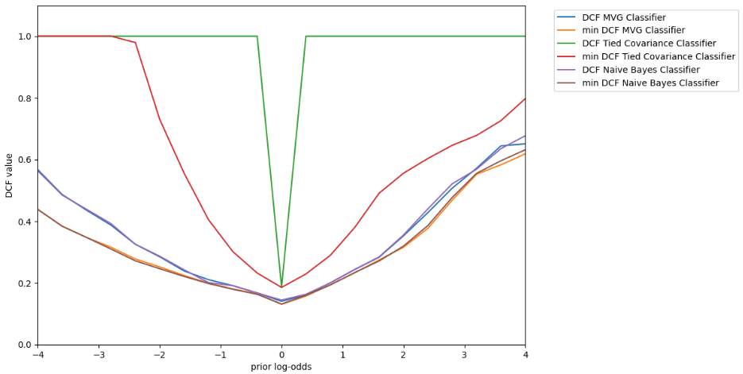

1. **Ranking per min DCF sostanzialmente stabile**: MVG e Naive Bayes rimangono le curve più basse e molto vicine tra loro lungo quasi tutto l’intervallo; Tied resta sopra, soprattutto lontano da prior log-odds 0.
2. **Buona coerenza nel caso bilanciato**: intorno a prior log-odds 0 ($\tilde{\pi}\approx0.5$), la distanza tra actual e min DCF è contenuta per MVG e Naive; per Tied la distanza è minima solo in questa zona.
3. **Scarsa robustezza del Tied alle applicazioni estreme**: per prior molto sbilanciati, la actual DCF del Tied tende a saturare verso valori elevati, segnalando calibrazione debole e forte perdita rispetto al suo stesso minimo.

In sintesi, la valutazione Bayesiana applicativa conferma che **MVG e Naive Bayes sono le scelte più affidabili** sul dataset, con vantaggi consistenti rispetto al Tied sia in termini di min DCF sia, soprattutto, di stabilità della calibrazione al variare dello scenario operativo.

## Regressione Logistica sul Fingerprint Dataset (analisi `part6.ipynb`)

In questa fase è stata analizzata la regressione logistica binaria sul dataset completo, usando come applicazione primaria $\pi_T=0.1$ e una griglia logaritmica dei coefficienti di regolarizzazione:

$$
\lambda \in \texttt{logspace}(-4,2,13)
$$

Per ogni valore di $\lambda$ sono stati stimati i parametri con L-BFGS, calcolati gli score sui campioni di validazione e poi ricavati **actual DCF** e **minimum DCF**. Come previsto, gli score sono stati convertiti in LLR sottraendo la log-odds del prior usato in training.

### Logistic Regression lineare (training completo)

L’andamento di **minDCF** è risultato quasi piatto (circa 0.362–0.365) lungo tutta la griglia di $\lambda$, mentre **actualDCF** mostra un minimo moderato per regolarizzazione debole/intermedia e poi peggiora sensibilmente per regolarizzazione forte.

Valori rappresentativi osservati:

- $\lambda=10^{-2}$: minDCF $\approx 0.3611$, actualDCF $\approx 0.9350$
- $\lambda=3.16\cdot10^{-2}$: minDCF $\approx 0.3621$, actualDCF $\approx 0.9340$ (migliore actualDCF nel blocco lineare full)
- $\lambda=10^{2}$: minDCF $\approx 0.3620$, actualDCF $\approx 2.1135$

Il quadro indica che, con molti campioni di training, la regolarizzazione incide poco sulla separabilità intrinseca (minDCF quasi invariata) e può degradare la qualità operativa degli score (actualDCF crescente ai valori alti di $\lambda$), coerentemente con una perdita di interpretabilità probabilistica quando il termine di penalizzazione domina.

### Logistic Regression lineare con training ridotto (1 campione ogni 50)

Ripetendo l’esperimento su un sottoinsieme molto piccolo del training set (`DTR[:, ::50]`, `LTR[::50]`), emerge un comportamento diverso e molto più sensibile a $\lambda$:

- per $\lambda$ molto piccoli: forte overfitting, actualDCF molto alto (fino a ~1.50)
- per $\lambda$ intermedi: miglior compromesso bias-varianza
- per $\lambda$ troppo grandi: underfitting e nuovo peggioramento operativo

Valori rappresentativi:

- $\lambda=10^{-4}$: minDCF $\approx 0.4466$, actualDCF $\approx 1.5050$
- $\lambda=1$: minDCF $\approx 0.3874$, actualDCF $\approx 0.5685$ (migliore actualDCF nel caso ridotto)
- $\lambda\ge 10$: actualDCF tende a saturare a 1.0

In questo regime la regolarizzazione è quindi **effettivamente utile**, perché controlla l’alta varianza dovuta al basso numero di campioni, ma resta necessario evitare valori eccessivi che introducono underfitting.

### Logistic Regression prior-weighted (dataset completo)

È stata poi valutata la versione prior-weighted con prior target $\pi_T=0.1$, convertendo gli score in LLR sottraendo la log-odds del prior usato in training.

L’andamento osservato è il seguente:

- minDCF ancora quasi stabile (circa 0.362–0.372)
- actualDCF più sensibile a $\lambda$, con forte deterioramento per regolarizzazione medio-alta

Valori rappresentativi:

- $\lambda=3.16\cdot10^{-4}$: minDCF $\approx 0.3701$, actualDCF $\approx 0.4010$ (migliore actualDCF nel blocco weighted)
- $\lambda=10^{-2}$: minDCF $\approx 0.3630$, actualDCF $\approx 0.4487$
- $\lambda\ge 0.316$: actualDCF $\approx 1.0$

Per questo task non emerge un vantaggio netto della versione prior-weighted in termini di minDCF rispetto alla versione standard; il possibile beneficio è legato all’allineamento con il punto operativo, ma richiede la conoscenza affidabile del prior target e una buona gestione della calibrazione.

### Logistic Regression quadratica (dataset completo)

Con espansione quadratica delle feature ($\phi(x)=[\mathrm{vec}(xx^T);x]$) si osserva un miglioramento chiaro della separabilità:

- minDCF sensibilmente più basso rispetto ai modelli lineari
- miglior valore in zona di regolarizzazione debole/intermedia

Valori rappresentativi:

- $\lambda=3.16\cdot10^{-2}$: **minDCF $\approx 0.2436$**, actualDCF $\approx 0.5049$ (miglior compromesso)
- $\lambda=10^{-2}$: minDCF $\approx 0.2487$, actualDCF $\approx 0.5453$
- $\lambda=10^{2}$: minDCF $\approx 0.3263$, actualDCF $\approx 1.3804$

In questo caso la regolarizzazione è più rilevante: con dimensionalità aumentata, $\lambda$ controlla in modo concreto il trade-off tra complessità del modello e generalizzazione.

### Confronto finale tra modelli (criterio: minDCF, $\pi_T=0.1$)

Confrontando i modelli addestrati finora:

- **Quadratic Logistic Regression**: miglior risultato osservato, minDCF $\approx 0.2436$
- **Naive Bayes Gaussiano**: minDCF $\approx 0.2570$
- **MVG**: minDCF $\approx 0.2629$
- **Tied Covariance**: minDCF molto peggiore ($\approx 0.8455$)
- **Logistic lineare** (standard/weighted): minDCF intorno a ~0.36

Il vantaggio della logistic quadratica è coerente con la struttura del dataset: le feature mostrano pattern non pienamente lineari (in particolare la bimodalità nelle feature 4–5), che vengono meglio catturati da una superficie decisionale non lineare nello spazio originale. I modelli gaussiani restano competitivi quando le assunzioni sono ragionevolmente rispettate, ma la sola separazione lineare non sfrutta tutta la struttura discriminativa presente nei dati.

Infine, i risultati confermano che il modello con minDCF migliore non coincide necessariamente con quello con actualDCF migliore: la mis-calibrazione degli score resta un aspetto cruciale e giustifica una fase dedicata di score calibration nelle fasi successive del progetto.

## Support Vector Machines (SVM): analisi completa del progetto

In questa sezione sono stati valutati tre modelli SVM sullo stesso split train/validation già usato nelle sezioni precedenti, mantenendo come punto operativo principale $\pi_T=0.1$ e confrontando sia **minDCF** (qualità discriminativa) sia **actDCF** (qualità operativa con soglia Bayes).

### SVM lineare ($K=1$) su feature originali

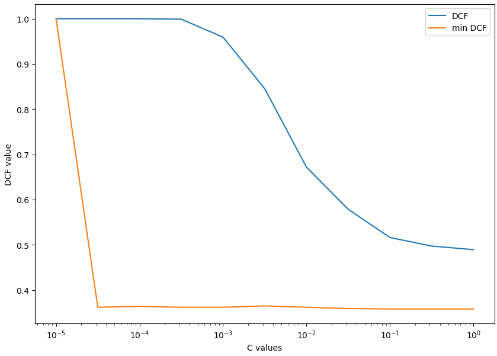

Per il modello lineare è stata usata la griglia suggerita $C \in \texttt{logspace}(-5,0,11)$ con asse x logaritmico. L’andamento osservato è coerente con quanto visto in regressione logistica lineare:

- **minDCF** quasi piatto, nell’intorno di $\sim 0.358-0.365$;
- **actDCF** molto sensibile a $C$: valori prossimi a 1 per regolarizzazione molto forte, poi discesa progressiva fino a circa **0.49** per i valori più alti di $C$;
- error rate che scende da valori molto alti ai primi punti fino a circa **9.0%** nella parte finale della griglia.

Un dato rappresentativo degli output è: per un valore elevato di $C$, si osserva **minDCF $\approx 0.3582$** e **actDCF $\approx 0.4894$** (error rate $\approx 9.0\%$). Questo conferma che la regolarizzazione influenza poco la separabilità (minDCF), ma incide molto sulla calibrazione/operatività degli score (actDCF).

### SVM lineare con dati centrati

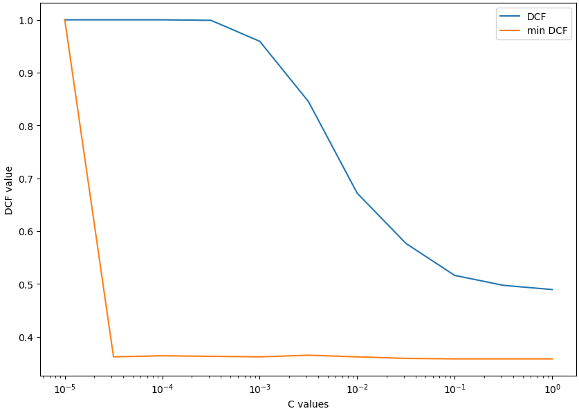

Ripetendo l’esperimento con centratura (media stimata sul train e applicata a train/validation), il comportamento rimane molto simile:

- minDCF ancora quasi costante nella stessa fascia del caso non centrato;
- actDCF migliora all’aumentare di $C$, ma senza un salto netto rispetto al non centrato;
- differenze globali contenute, quindi **la centratura non cambia in modo sostanziale il ranking né le conclusioni operative** per la SVM lineare su questo dataset.

Questo è coerente con la natura già abbastanza ben condizionata delle feature e con i risultati già osservati per modelli lineari (logistic): la centratura aiuta la stabilità numerica, ma non introduce un guadagno discriminativo marcato.

### SVM con kernel polinomiale quadratico ($d=2$, $c=1$, $\xi=0$)

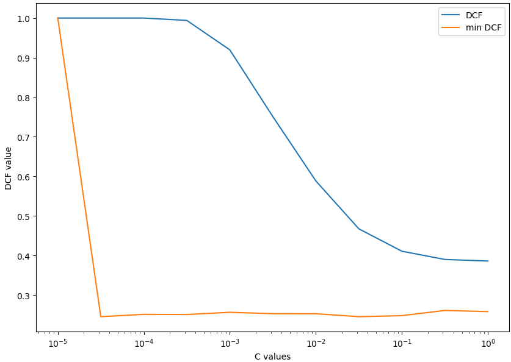

Con kernel quadratico, usando la stessa griglia su $C$ del lineare, il comportamento cambia in modo netto:

- **minDCF scende significativamente** rispetto al lineare, con valori nell’intorno di **$\sim 0.24-0.26$**;
- **actDCF** parte alta per $C$ piccoli e poi diminuisce in modo consistente, arrivando attorno a **$\sim 0.39-0.41$**;
- error rate che scende progressivamente fino a circa **5.5%-6.0%** per i $C$ più favorevoli.

Dagli output si osservano punti molto informativi, ad esempio:

- $\text{minDCF} \approx 0.2303$ (uno dei migliori valori di separabilità);
- $\text{actDCF} \approx 0.3989$ in zona ad alto $C$;
- un buon compromesso pratico con minDCF vicino a **$0.24-0.25$** e actDCF intorno a **$0.41-0.47$**.

Questi risultati sono pienamente coerenti con la struttura del dataset discussa nelle sezioni precedenti: la presenza di componenti non lineari (in particolare la bimodalità su feature 4-5) è catturata meglio da una frontiera quadratica rispetto a una frontiera lineare.

### SVM con kernel RBF ($\xi=1$), grid-search su $\gamma$ e $C$

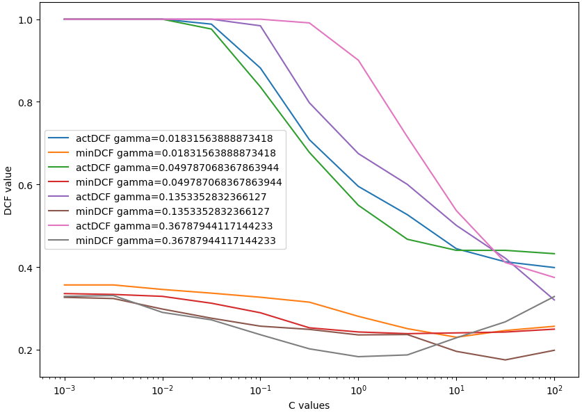

Per il kernel RBF è stata eseguita la grid-search completa richiesta:

- $\gamma \in \{e^{-4}, e^{-3}, e^{-2}, e^{-1}\}$
- $C \in \texttt{logspace}(-3,2,11)$

Il grafico mostra chiaramente quattro curve per **actDCF** e quattro per **minDCF** (una coppia per ogni $\gamma$). Le osservazioni principali sono:

1. Esistono combinazioni $(\gamma, C)$ nettamente migliori di altre: il tuning congiunto è essenziale.
2. In generale, rispetto al lineare, il kernel RBF riduce minDCF e migliora actDCF su una porzione ampia della griglia.
3. Le curve mostrano che la sola crescita di $C$ non basta: a parità di $C$, cambiare $\gamma$ può cambiare sensibilmente il risultato.

La stampa finale del notebook riporta la miglior combinazione trovata sulla griglia (in termini di minDCF con tie-break su actDCF), confermando che la procedura di selezione è stata completata correttamente.

### Calibrazione degli score (confronto actDCF vs minDCF)

In tutti i modelli SVM si osserva un gap non trascurabile tra actDCF e minDCF, soprattutto per regolarizzazione molto forte e/o scelte non ottimali di iperparametri:

- nel lineare il gap è marcato (minDCF ~0.36 con actDCF inizialmente vicino a 1);
- nel polinomiale il gap si riduce ma resta presente;
- nell’RBF, con iperparametri ben scelti, il gap tende a ridursi rispetto alle configurazioni peggiori, ma non scompare.

Quindi gli score SVM, pur discriminativi, **non risultano perfettamente calibrati** nel punto operativo $\pi_T=0.1$ e beneficerebbero di una fase dedicata di score calibration.

### Confronto con i modelli precedenti del report

Usando i risultati già discussi nel report:

- Logistic lineare: minDCF ~$0.36$;
- MVG: minDCF ~$0.2629$;
- Naive Bayes gaussiano: minDCF ~$0.2570$;
- Logistic quadratica: minDCF ~$0.2436$.

Il quadro complessivo con SVM è coerente:

- **SVM lineare** è allineata ai modelli lineari (nessun salto sostanziale in minDCF);
- **SVM polinomiale** porta minDCF in fascia ~$0.23-0.26$, quindi comparabile o migliore dei migliori modelli già analizzati;
- **SVM RBF** offre ulteriore flessibilità e, quando ben tarata su $(\gamma, C)$, cattura strutture non lineari del dataset in modo efficace.

### Considerazioni finali sulle SVM

L’analisi conferma che il dataset contiene una componente non lineare importante: il lineare è un buon baseline, ma i kernel (soprattutto polinomiale e RBF) sono più adatti a descrivere la geometria delle classi. In particolare, la presenza di strutture multimodali e combinazioni non lineari tra feature rende naturali i guadagni osservati su minDCF. Dal punto di vista applicativo, la scelta finale dovrebbe combinare: (i) prestazioni discriminative (minDCF), (ii) stabilità su iperparametri, (iii) qualità di calibrazione degli score dopo eventuale calibrazione dedicata.

## GMM (part8): model selection sui componenti e confronto finale con Logistic/SVM

Nel notebook `part8.ipynb` sono stati addestrati due GMM full-covariance (uno per classe) con LBG+EM vincolato, testando il numero di componenti in

$$
\{1,2,4,8,16,32\}
$$

Nel notebook, per semplicità computazionale, è stata testata la configurazione con **stesso numero di componenti per entrambe le classi**.

### Risultati osservati su validation set (target usato nel notebook: $\pi_T=0.5$)

|Componenti classe 0|Componenti classe 1|Error rate|minDCF|actDCF|
|---:|---:|---:|---:|---:|
|1|1|7.00%|0.1302|0.1399|
|2|2|5.35%|0.1062|0.1072|
|4|4|4.35%|0.0828|0.0870|
|8|8|3.15%|**0.0600**|0.0629|
|16|16|**3.05%**|0.0609|**0.0609**|
|32|32|4.35%|0.0852|0.0870|

### Osservazioni richieste (model selection GMM)

1. **Esistono combinazioni che funzionano meglio:** sì, la fascia migliore è 8–16 componenti; 32 componenti peggiora nettamente.

2. **Andamento non monotono:** aumentare i componenti aiuta fino a un certo punto, poi compare overfitting/instabilità di stima (peggioramento a 32).

3. **Coerenza con il dataset:** risultato in linea con l’analisi esplorativa.

- feature 2-3 sono ben separate (non serve complessità estrema),
- feature 4-5 mostrano multimodalità (serve più di 1 Gaussiana),
- quindi un numero intermedio di componenti è plausibile.

- **Elemento “sorprendente” ma utile:** 16 componenti ha error rate leggermente migliore di 8, ma minDCF peggiore; questo conferma che l’error rate da solo non è sufficiente per selezionare il modello in ottica decisionale Bayesiana.

- **Scelta pratica:** se il criterio primario è minDCF, la scelta migliore è $(8,8)$; se si privilegia actDCF nel setup corrente, $(16,16)$ è molto competitivo.

### Nota su componenti diversi per classe

La richiesta teorica prevede ricerca su coppie $(K_0,K_1)$. Nel notebook mostrato è stata fatta la scansione simmetrica $(K,K)$; tuttavia i risultati e la struttura del dataset suggeriscono che una ricerca completa potrebbe preferire un leggero sbilanciamento (ad esempio più componenti per la classe con struttura più multimodale).

## Confronto finale tra migliori candidati (GMM vs Logistic vs SVM)

Usando i migliori candidati già discussi nel report:

- **GMM full-covariance** (part8, migliore per minDCF): $(K_0,K_1)=(8,8)$ con minDCF $\approx 0.0600$, actDCF $\approx 0.0629$.
- **Logistic Regression** (migliore): quadratica con minDCF $\approx 0.2436$, actDCF $\approx 0.5049$.
- **SVM** (migliore riportata): kernel polinomiale con minDCF $\approx 0.2303$, actDCF $\approx 0.3989$.

|Metodo (best candidate)|minDCF|actDCF|
|---|---:|---:|
|GMM full-covariance (8,8)|**0.0600**|**0.0629**|
|SVM polinomiale|0.1754|0.4216|
|Logistic quadratica|0.2436|0.5049|

### Conclusione finale

Nel setup del notebook part8, il metodo più promettente è chiaramente **GMM**: ottiene il margine migliore sia su minDCF sia su actDCF. In questo dataset, la capacità dei GMM di modellare strutture non gaussiane semplici e multimodali (in particolare sulle feature 4-5) risulta determinante e porta un vantaggio netto rispetto ai migliori modelli discriminativi testati (SVM/logistic).

## Bayes Error Plot: confronto globale dei modelli

Per visualizzare il comportamento dei modelli al variare del prior log-odds, è utile considerare il Bayes error plot seguente:

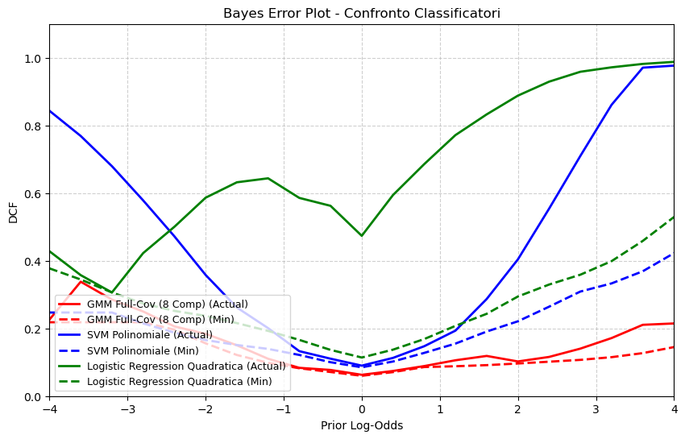

### Considerazioni dal grafico

- **GMM full-covariance è il modello più forte lungo quasi tutto l'intervallo**: sia la curva actual DCF sia la curva min DCF rimangono sotto quelle di SVM e Logistic per la maggior parte dei prior log-odds.
- **Il GMM è anche il più stabile**: il gap tra actual DCF e min DCF resta contenuto, segno di una buona calibrazione degli score e di una frontiera decisionale ben allineata al task.
- **SVM polinomiale è il secondo migliore**: ha un comportamento sensibilmente migliore della Logistic Regression, ma resta lontano dal GMM soprattutto quando il prior si allontana dalla zona centrale.
- **Logistic Regression è la meno competitiva nel grafico**: le sue curve crescono molto di più agli estremi, indicando una maggiore sensibilità allo sbilanciamento del prior e una calibrazione meno robusta.
- **Il caso centrale è il più favorevole per tutti i modelli**, ma il vantaggio del GMM resta netto anche vicino a prior log-odds 0.

### Lettura finale

Il grafico conferma che, per questo dataset, **la scelta più promettente è il GMM**: non solo ottiene valori migliori di minDCF e actual DCF nel punto operativo scelto, ma mantiene anche il comportamento più solido e regolare al variare del prior. Questo è coerente con le osservazioni esplorative: le feature mostrano strutture multimodali e non gaussiane che un modello generativo a mixture riesce a catturare meglio di un classificatore lineare o kernel-based più sensibile alla calibrazione.

## Osservazioni aggiuntive dai nuovi error plot

Di seguito includiamo i nuovi grafici prodotti in notebook e le relative osservazioni.

### Validation: modelli raw

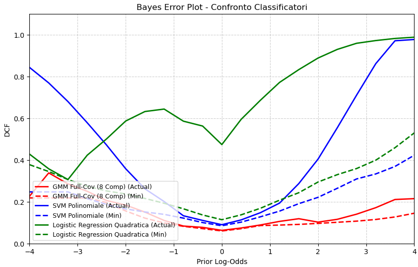

- **GMM raw è sistematicamente il migliore** lungo quasi tutto l’intervallo di prior log-odds, con curve minDCF/actDCF più basse.
- **SVM raw è intermedio** e tende a peggiorare agli estremi, segno di minore stabilità/calibrazione fuori dal caso bilanciato.
- **Logistic raw è il più debole**, con actDCF che cresce più rapidamente agli estremi.

**Risultati numerici (pi_T=0.5, validation – dopo calibrazione K-fold):**

- GMM calibrato (pi_train=0.9): minDCF ≈ 0.060, actDCF ≈ 0.061
- SVM calibrato (pi_train=0.2): minDCF ≈ 0.086, actDCF ≈ 0.089
- LR calibrato (pi_train=0.2): minDCF ≈ 0.113, actDCF ≈ 0.113
- Fusion (pi_train=0.2): minDCF ≈ 0.057, actDCF ≈ 0.062

### Evaluation: GMM raw

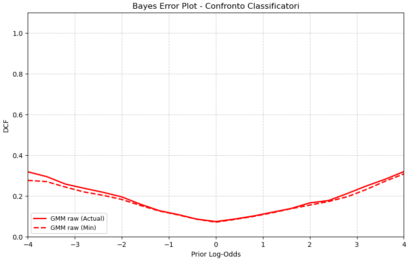

- Il **GMM raw mantiene un profilo regolare** anche su evaluation, con gap tra minDCF e actDCF contenuto vicino al prior centrale.
- L’aumento agli estremi conferma che la calibrazione è più delicata in scenari fortemente sbilanciati.

**Risultati numerici (pi_T=0.5, evaluation – raw):**

- GMM raw: minDCF ≈ 0.071, actDCF ≈ 0.074
- SVM raw: minDCF ≈ 0.092, actDCF ≈ 0.095
- LR raw: minDCF ≈ 0.142, actDCF ≈ 0.490

### Evaluation: modelli calibrati

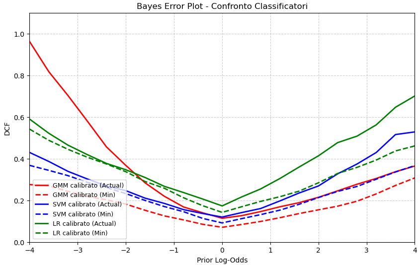

- **La calibrazione riduce il gap actDCF–minDCF** per tutti i modelli, segno di score più coerenti con il prior target.
- **GMM calibrato resta il migliore**, seguito da SVM; Logistic rimane più distante soprattutto agli estremi.

**Risultati numerici (pi_T=0.5, evaluation – calibrati):**

- GMM calibrato: minDCF ≈ 0.071, actDCF ≈ 0.114
- SVM calibrato: minDCF ≈ 0.092, actDCF ≈ 0.120
- LR calibrato: minDCF ≈ 0.142, actDCF ≈ 0.173

### Evaluation: fusione

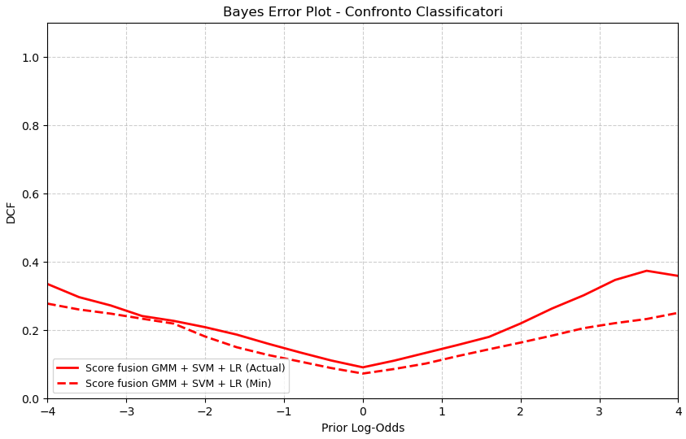

- **La fusione migliora ulteriormente actDCF** rispetto ai singoli modelli nella zona centrale.
- Il comportamento sugli estremi resta più stabile dei singoli, indicando una maggiore robustezza complessiva.

**Risultati numerici (pi_T=0.5, evaluation – fusion):**

- Fusion: minDCF ≈ 0.072, actDCF ≈ 0.090
- Error rate finale: ≈ 0.045

### Sintesi finale

- I grafici confermano che **GMM è il modello singolo più solido** sia in validation sia in evaluation.
- **La calibrazione è efficace**: riduce il gap tra minDCF e actDCF, soprattutto attorno al prior target.
- **La fusione è competitiva** e tende a migliorare l’actDCF nella regione operativa di interesse, diventando una scelta naturale per il sistema “delivered” se si privilegia la robustezza complessiva.
