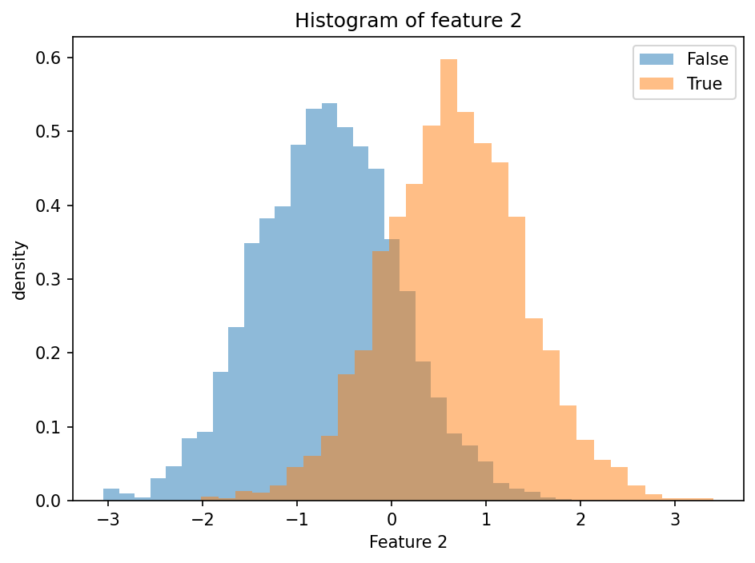
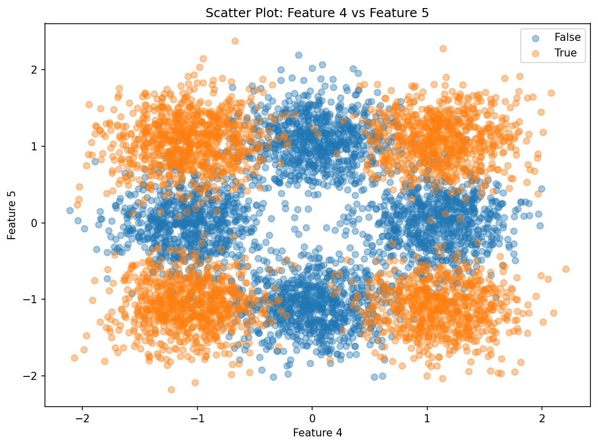
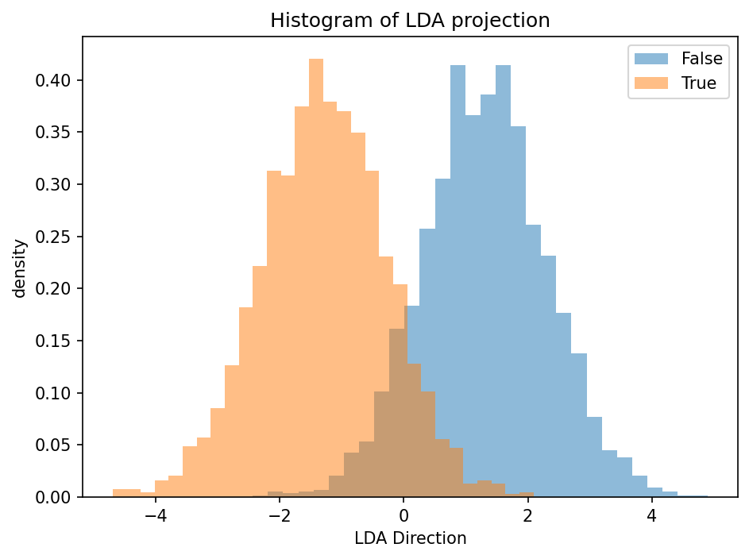
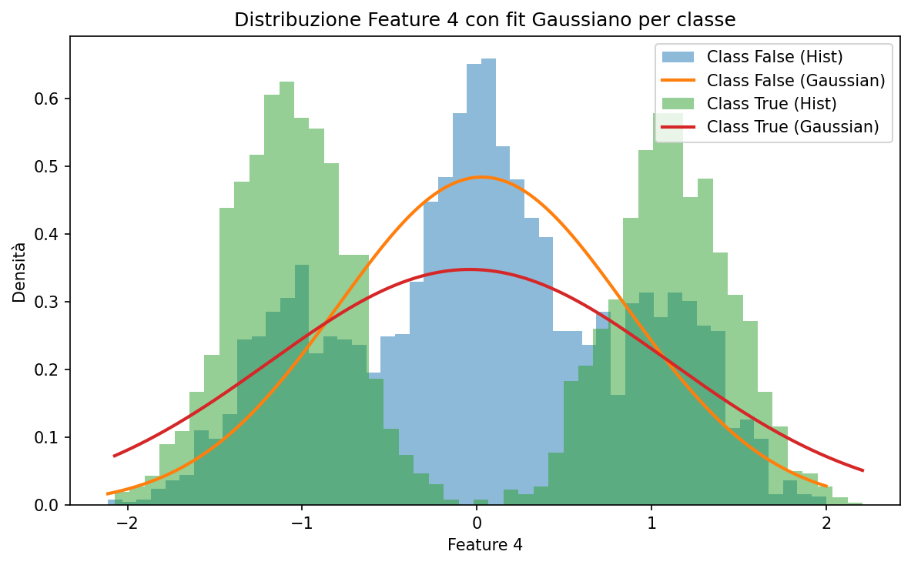
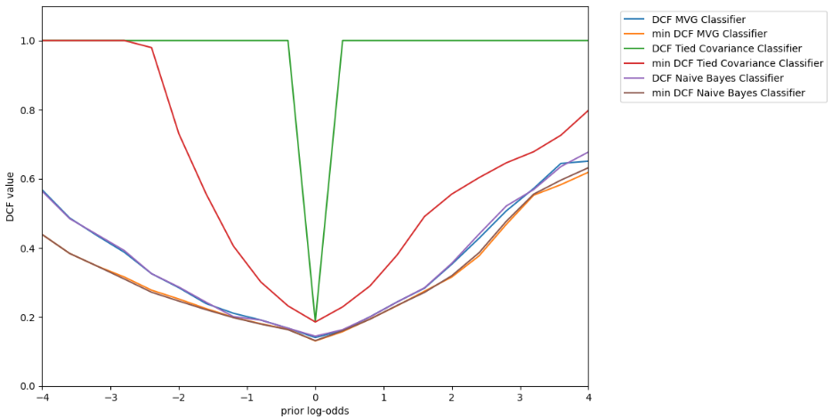
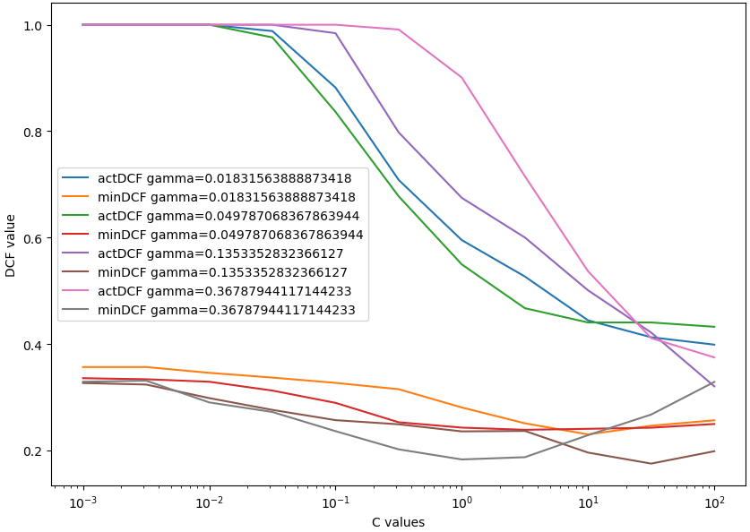
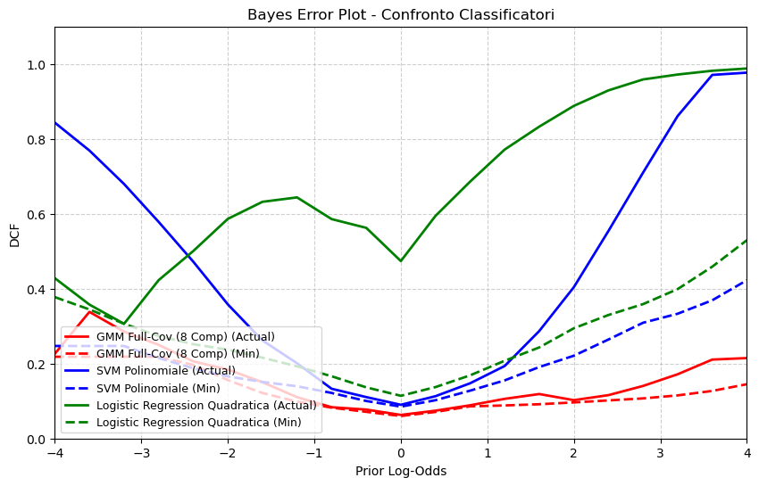
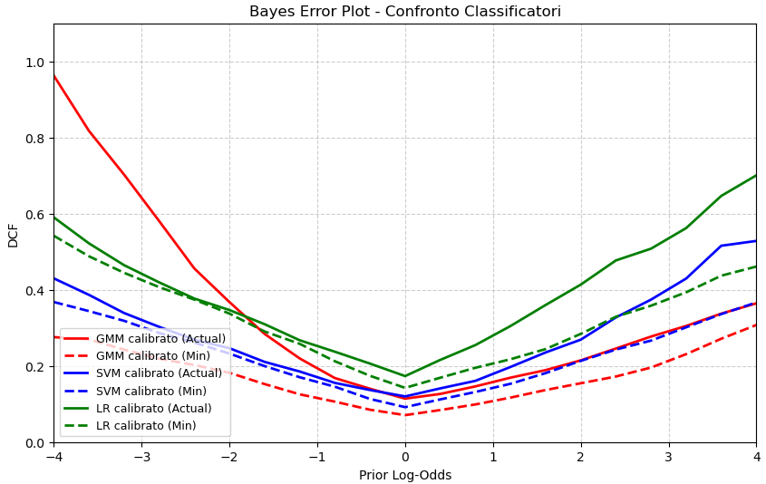
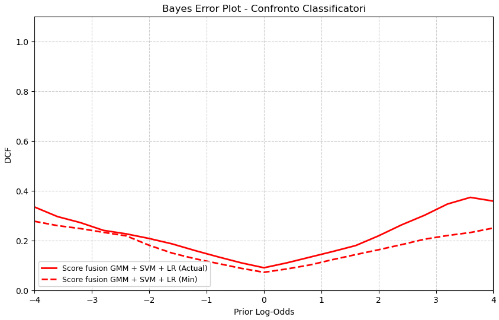

# Fingerprint Spoofing Detection

A machine learning project for binary classification of fingerprint images as **genuine** (label 1) or **spoofed** (label 0). The pipeline covers exploratory data analysis, dimensionality reduction, generative and discriminative classifiers, score calibration, and model fusion.

## Table of Contents

- [Dataset](#dataset)
- [Project Structure](#project-structure)
- [How to Run](#how-to-run)
- [Pipeline Overview](#pipeline-overview)
  - [1 — Exploratory Data Analysis](#1--exploratory-data-analysis)
  - [2 — PCA and LDA](#2--pca-and-lda)
  - [3 — Gaussian Density Estimation](#3--gaussian-density-estimation)
  - [4 — Gaussian Classifiers](#4--gaussian-classifiers)
  - [5 — Bayes Error Analysis](#5--bayes-error-analysis)
  - [6 — Logistic Regression](#6--logistic-regression)
  - [7 — Support Vector Machines](#7--support-vector-machines)
  - [8 — Gaussian Mixture Models](#8--gaussian-mixture-models)
  - [9 — Calibration and Fusion](#9--calibration-and-fusion)
- [Key Functions Reference](#key-functions-reference)
- [Results Summary](#results-summary)

---

## Dataset

| Property | Value |
|---|---|
| Samples | 6 000 (training) + 6 000 (evaluation) |
| Features | 6 (extracted by a pre-trained feature extractor) |
| Classes | 0 — Spoofed, 1 — Genuine |
| Class balance | Approximately balanced |
| Format | CSV (`trainData.txt`, `evalData.txt`) — 6 feature columns + 1 label column |

---

## Project Structure

```
fingerprint-spoofing-detection/
├── trainData.txt                 # Training data (6 000 samples)
├── evalData.txt                  # Evaluation data (6 000 samples)
├── notebook/
│   ├── 01_Plots_And_Statistics.ipynb    # Exploratory data analysis
│   ├── 02_PCA_LDA.ipynb                # PCA & LDA dimensionality reduction
│   ├── 03_LogLikelihood.ipynb           # Gaussian density fitting & log-likelihood
│   ├── 04_Gaussian_Classifiers.ipynb    # MVG, Naive Bayes, Tied Covariance
│   ├── 05_Bayes_Error.ipynb             # DCF computation & Bayes error plots
│   ├── 06_Logistic_Regression.ipynb     # Linear & quadratic logistic regression
│   ├── 07_SVM.ipynb                     # Linear, polynomial & RBF SVMs
│   ├── 08_GMM.ipynb                     # GMM with LBG + EM
│   └── 09_Calibration_Fusion.ipynb      # Score calibration & fusion
├── scripts/
│   ├── utils.py                  # Data loading & train/val split
│   ├── pca.py                    # PCA projection
│   ├── lda.py                    # LDA projection
│   ├── plots.py                  # Histogram & scatter plot utilities
│   ├── logpdf_GAU_ND.py          # Multivariate Gaussian log-density
│   ├── gaussianclassifiers.py    # MVG / Naive Bayes / Tied classifiers
│   ├── dcf.py                    # DCF, minDCF & Bayes error plot
│   ├── logisticreg.py            # Logistic regression (linear & quadratic)
│   ├── SVM.py                    # SVM dual formulation (linear/poly/RBF)
│   ├── GMM.py                    # GMM with EM + LBG initialisation
│   ├── calibration.py            # Score calibration & fusion
│   └── classify_with_lda_pca.py  # LDA classifier with optional PCA
└── images/                       # All plots generated by the notebooks
```

---

## How to Run

### Prerequisites

- Python ≥ 3.9
- Required packages: `numpy`, `scipy`, `matplotlib`

```bash
pip install numpy scipy matplotlib
```

### Running the notebooks

Open a notebook with Jupyter and execute cells sequentially. Each notebook imports helper functions from `scripts/` via relative paths, so **launch Jupyter from the repository root** (or from `notebook/`):

```bash
jupyter notebook notebook/01_Plots_And_Statistics.ipynb
```

The notebooks are numbered and should be explored in order — later notebooks may reference results or saved scores from earlier ones.

### Validation split

Unless otherwise noted, the training data is split **2/3 training — 1/3 validation** with `seed=0` for reproducibility (see `utils.split_db_2to1`).

---

## Pipeline Overview

### 1 — Exploratory Data Analysis

**Notebook:** `01_Plots_And_Statistics.ipynb`

Histograms and scatter plots reveal three groups of features:

| Features | Behaviour |
|---|---|
| 0, 1 | Similar means, complementary variances (one class wide, the other narrow) |
| 2, 3 | Well-separated means (~1.35 apart), similar variances — **most discriminative** |
| 4, 5 | Strong overlap; the genuine class shows clear **bimodality** (two clusters) |

Selected plots:




---

### 2 — PCA and LDA

**Notebook:** `02_PCA_LDA.ipynb`

- **PCA** (all 6 components): a rigid rotation of the original space — it does not improve class separability, only reveals the directions of maximum total variance.
- **LDA** (1 discriminant direction for binary classification): finds the linear combination that maximises the Fisher ratio and achieves significantly less class overlap than any single original feature.



**LDA classification results** (threshold = midpoint of projected class means):

| Metric | Value |
|---|---|
| Error rate | 9.3 % |
| Accuracy | 90.7 % |

PCA pre-processing (m = 2–4) yields only a marginal improvement (9.2 %), confirming that LDA on the raw 6-D features is already near-optimal for a linear approach.

---

### 3 — Gaussian Density Estimation

**Notebook:** `03_LogLikelihood.ipynb`

Per-class maximum-likelihood Gaussian fits are evaluated for each feature:

- **Good fit:** Features 2 and 3 (unimodal, symmetric).
- **Acceptable fit:** Features 0 and 1.
- **Poor fit:** Features 4 and 5 — clear bimodality that a single Gaussian cannot capture.

Covariance analysis shows **very low inter-feature correlation** (max Pearson |r| ≈ 0.05), which explains why Naive Bayes performs almost as well as the full MVG.



---

### 4 — Gaussian Classifiers

**Notebook:** `04_Gaussian_Classifiers.ipynb`

Three Gaussian classifiers are compared using the log-likelihood ratio $s(x) = \log f(x \mid C{=}1) - \log f(x \mid C{=}0)$ with threshold $t = 0$:

| Classifier | Error rate | Accuracy |
|---|---|---|
| **MVG** (full covariance) | **7.0 %** | **93.0 %** |
| Naive Bayes (diagonal cov.) | 7.2 % | 92.8 % |
| Tied Covariance (shared cov.) | 9.3 % | 90.7 % |

Key take-aways:

- The tiny MVG–NB gap (0.2 %) confirms near-independence of features.
- Tied Covariance is too restrictive when feature variances differ across classes.
- Discarding features 4–5 degrades MVG and NB by ~1.15 %, proving that even poorly-Gaussian features carry useful discriminative information.

---

### 5 — Bayes Error Analysis

**Notebook:** `05_Bayes_Error.ipynb`

Detection Cost Functions (actual DCF and minimum DCF) are computed for three effective priors $\tilde{\pi} \in \{0.1, 0.5, 0.9\}$. The Bayes error plot below sweeps over the full prior log-odds range:



- MVG and Naive Bayes are the most reliable across all operating points.
- Tied Covariance saturates at extreme priors, indicating poor calibration.

---

### 6 — Logistic Regression

**Notebook:** `06_Logistic_Regression.ipynb`

Linear, prior-weighted, and **quadratic** logistic regression models are evaluated over $\lambda \in \text{logspace}(-4, 2, 13)$ at $\pi_T = 0.1$.

| Model variant | Best minDCF |
|---|---|
| Linear (full training) | ~0.362 |
| Linear (1/50 training) | ~0.387 |
| Prior-weighted | ~0.370 |
| **Quadratic** | **~0.244** |

The quadratic expansion captures the non-linear structure (feature 4–5 bimodality) missed by the linear boundary, achieving a minDCF competitive with the best Gaussian classifiers.

---

### 7 — Support Vector Machines

**Notebook:** `07_SVM.ipynb`

| SVM Kernel | Best minDCF | Best actDCF | Best error rate |
|---|---|---|---|
| Linear ($K{=}1$) | ~0.358 | ~0.489 | ~9.0 % |
| Polynomial ($d{=}2, c{=}1$) | ~0.230 | ~0.399 | ~5.5 % |
| RBF (grid on $\gamma, C$) | best from grid | — | — |



Non-linear kernels improve minDCF substantially over the linear baseline, consistent with the dataset's multimodal structure. Centring the data has minimal impact.

---

### 8 — Gaussian Mixture Models

**Notebook:** `08_GMM.ipynb`

Full-covariance GMMs are trained with LBG + EM for $K \in \{1, 2, 4, 8, 16, 32\}$ components per class:

| Components (per class) | Error rate | minDCF | actDCF |
|---|---|---|---|
| 1 | 7.00 % | 0.1302 | 0.1399 |
| 2 | 5.35 % | 0.1062 | 0.1072 |
| 4 | 4.35 % | 0.0828 | 0.0870 |
| **8** | 3.15 % | **0.0600** | 0.0629 |
| 16 | **3.05 %** | 0.0609 | **0.0609** |
| 32 | 4.35 % | 0.0852 | 0.0870 |

**GMM (8, 8) achieves the best minDCF (0.0600)**, dramatically outperforming all discriminative models. Performance degrades at 32 components due to over-fitting.



---

### 9 — Calibration and Fusion

**Notebook:** `09_Calibration_Fusion.ipynb`

K-fold logistic regression calibration is applied to the scores of the three best models (GMM, SVM, LR). Score fusion stacks calibrated scores and trains a joint logistic regression.

#### Validation results ($\pi_T = 0.5$, after K-fold calibration)

| Model | minDCF | actDCF |
|---|---|---|
| GMM calibrated | 0.060 | 0.061 |
| SVM calibrated | 0.086 | 0.089 |
| LR calibrated | 0.113 | 0.113 |
| **Fusion** | **0.057** | **0.062** |

#### Evaluation results ($\pi_T = 0.5$)

| Model | minDCF | actDCF |
|---|---|---|
| GMM calibrated | 0.071 | 0.114 |
| SVM calibrated | 0.092 | 0.120 |
| LR calibrated | 0.142 | 0.173 |
| **Fusion** | **0.072** | **0.090** |




---

## Key Functions Reference

Below is a summary of the main helper functions in `scripts/`.

| Module | Function | Purpose |
|---|---|---|
| `utils.py` | `init_dataset()` | Load CSV data → features matrix + labels array |
| | `split_db_2to1(D, L, seed)` | Stratified 2/3–1/3 train/val split |
| | `vCol(v)` / `vRow(v)` | Reshape a 1-D array into a column / row vector |
| | `getMu(X)` / `getC(X)` | Compute mean and covariance of a data matrix |
| | `compute_Sb_Sw(D, L)` | Between-class and within-class scatter matrices |
| `pca.py` | `train_PCA(X, m)` | Compute PCA projection (top `m` eigenvectors) |
| | `apply_PCA(X, P, mu)` | Project centred data onto PCA subspace |
| `lda.py` | `train_LDA(X, L, m)` | Compute LDA projection via generalised eigenvalue problem |
| | `apply_LDA(X, W)` | Project data onto LDA subspace |
| `plots.py` | `getHist(...)` | Per-feature class-conditional normalised histograms |
| | `getScatters(...)` | Pairwise scatter plots coloured by class |
| | `plot_bayes_error(...)` | Bayes error plot (actual/min DCF vs prior log-odds) |
| `logpdf_GAU_ND.py` | `logpdf_GAU_ND(x, mu, C)` | Multivariate Gaussian log-density |
| | `loglikelihood(X, mu, C)` | Sum of log-densities over all samples |
| `gaussianclassifiers.py` | `get_params_MVG(DTR, LTR)` | ML estimates of per-class μ and Σ |
| | `get_params_Naive_Bayes(...)` | Diagonal covariance variant |
| | `get_params_Tied_Covariance(...)` | Shared within-class covariance variant |
| | `MVG_Classifier(...)` / `Naive_Bayes_Classifier(...)` / `Tied_Covariance_Classifier(...)` | End-to-end classify + evaluate |
| `dcf.py` | `DCF_norm(scores, labels, pi, Cfn, Cfp)` | Normalised Bayes risk (actual DCF) |
| | `compute_min_dcf(scores, labels, pi, Cfn, Cfp)` | Minimum DCF over all thresholds |
| | `get_bayes_decision(scores, pi, Cfn, Cfp)` | Optimal Bayes decision given prior and costs |
| `logisticreg.py` | `trainLogReg(DTR, LTR, l)` | L-BFGS logistic regression training |
| | `weighted_trainLogReg(DTR, LTR, l, piT)` | Prior-weighted logistic regression |
| | `expand_features(D)` | Quadratic feature expansion $\phi(x) = [\text{vec}(xx^T); x]$ |
| `SVM.py` | `train_SVM(DTR, LTR, C, K)` | Linear SVM via dual formulation |
| | `train_kernel_poly_SVM(DTR, LTR, C, d, c)` | Polynomial kernel SVM |
| | `train_kernel_KRB(DTR, LTR, C, gamma)` | RBF kernel SVM |
| `GMM.py` | `LBG_constrained(X, K, psi)` | LBG + EM training with eigenvalue-constrained covariance |
| | `logpdf_GMM(X, gmm)` | Per-component and marginal log-densities |
| `calibration.py` | `extract_kfold_calibrated_scores(scores, L, ...)` | K-fold logistic regression calibration |
| | `calibrate_scores(scores, w, b)` | Apply trained calibration to new scores |
| | `best_GMM(...)` / `best_SVM(...)` / `best_LR(...)` | Produce scores from best model configs |

---

## Results Summary

| Model | minDCF ($\pi_T{=}0.5$) | actDCF ($\pi_T{=}0.5$) | Notes |
|---|---|---|---|
| LDA | — | — | 90.7 % accuracy (threshold-based) |
| MVG | 0.130 | 0.140 | Best single-Gaussian classifier |
| Naive Bayes | 0.131 | 0.144 | Near-identical to MVG |
| Tied Covariance | 0.185 | 0.186 | Too restrictive for this data |
| Logistic (quadratic) | 0.244 | 0.505 | Captures non-linear structure |
| SVM (poly, d=2) | 0.230 | 0.399 | Strong non-linear baseline |
| **GMM (8, 8)** | **0.060** | **0.063** | **Best single model** |
| **Fusion (calibrated)** | **0.057** | **0.062** | **Best overall (validation)** |

> [!NOTE]
> On the held-out evaluation set, the fused system achieves **minDCF ≈ 0.072** and **actDCF ≈ 0.090**, confirming that GMM-based generative modelling combined with score fusion yields the most robust fingerprint spoofing detector for this dataset.
